# 1. Product Introduction

**Keyestudio 4WD Mecanum Robot for Arduino**

## 1.1 Description  

When it comes to programming, many consider it difficult. However, KEYES group rolls out a 4WD Mecanum Robot kit to cope with this problem. This product not only allows your child to learn the knowledge of programming, but also electronics, mechanics, control logic and computer science.  

This is a low-cost, easy-to-operate and open source programming kit. In fact, it is also simple to install and connect from complex electronics integrated into a backplate and a 2.54 anti-plug terminal, which solely need a few simple assembly steps to build your own Mecanum robot car. 

Furthermore, it contains an IR remote control, seven-color LEDs, RGB2812, a line tracking sensor, a servo, motors, Mecanum wheels as well as an ultrasonic module. 

By the way, the detailed projects will guide you to learn the working principle of sensors and modules.

There are 12 programming courses in this kit, which rang from simple to complex. If this can not meet your demand, you can seek to alter code and add extra modules to enrich the functions.

That sounds entertaining, right? Let’s get started!

### 1.2 Features

1. Multi-purpose function: Color light display, IR control, bluetooth control, universal wheels control, ultrasonic following, ultrasonic obstacle avoidance, 4WD drive, car tracking, UNO PLUS control board, etc. 
2. Easy to build: Motor drive , RGB2812 and seven-color LEDs have been integrated on the bottom plate and without welding circuit. 
3. Novel style: We use the Mecanum wheels and the wirings between modules are simple. 
4. High extension: Preserve IIC, UART, SPI, ESP8266 WIFI and you can extend other sensors and modules. What’s more, the matrix keyboard has a strong controllability.
5. Basic programming learning：Using C language for Arduino IDE and Scratch graphical programming.

## 1.3 Parameters 

- Input voltage：7-12V
- Working voltage：5V
- Maximum power consumption：15W
- Motor speed: 5V 200RPM
- Motor drive mode: DRV8833 Motor drive
- Ultrasonic induction angle: <15 degrees
- Ultrasonic detection distance: 2cm-400cm
- Infrared remote control distance: 10M (measured)
- Bluetooth remote control distance: 50M(measured)
- Bluetooth control: Support Android and iOS system

## 1.4 Kit 

| No.  | Components                                  | QTY  | Picture                                |
| ---- | ------------------------------------------- | ---- | -------------------------------------- |
| 1    | Acrylic Board                               | 1    | 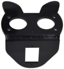                    |
| 2    | Acrylic Board with Lego Holes               | 1    | 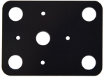                    |
| 3    | Motor Plate                                 | 4    | 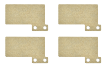 |
| 4    | Motor                                       | 4    | 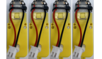 |
| 5    | Fixing Board                                | 4    | 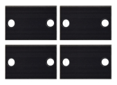                    |
| 6    | Bluetooth Module                            | 1    | 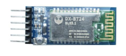                    |
| 7    | Servo                                       | 1    | 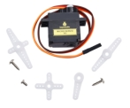                    |
| 8    | Mecanum Wheels                              | 4    | 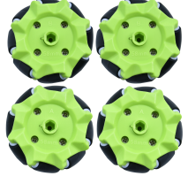 |
| 9    | Keyestudio Sensor Shield                    | 1    | 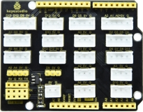                    |
| 10   | Keyestudio UNO PLUS                         | 1    | 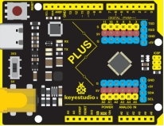                    |
| 11   | Keyestudio 4WD Mecanum Robot Car Base Board | 1    | 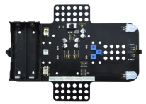                    |
| 12   | M3*15MM Dual-pass Copper Pillar             | 4    | 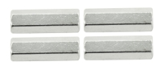                    |
| 13   | 4265c Lego Part                             | 4    | 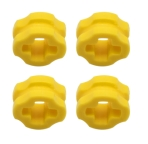                   |
| 14   | 43093 Lego Part                             | 4    | 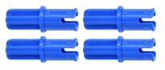                   |
| 15   | Acrylic Gasket                              | 1    | 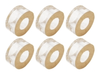                   |
| 16   | M3*6MM Flat Head Screw                      | 10   | 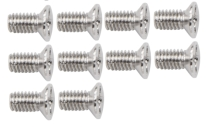                   |
| 17   | Ultrasonic Sensor                           | 1    | 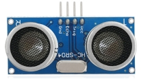                   |
| 18   | M3*8MM Flat Head Screw                      | 10   |                    |
| 19   | M3 Nickle-plated Nut                        | 10   | 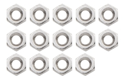                   |
| 20   | M3*30MM Round Head Screw                    | 9    | 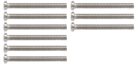 |
| 21   | M2  Nickle-plated Nut                       | 3    |                    |
| 22   | M2*8MM Round Head Screw                     | 3    | 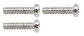                   |
| 23   | M1.4  Nickle-plated Nut                     | 6    | 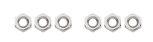 |
| 24   | M1.4*10MM Round Head Screw                  | 6    | 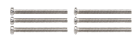 |
| 25   | M2.5*14MM Round Head Screw                  | 4    |                    |
| 26   | IR Remote Control                           | 1    |                    |
| 27   | USB Cable                                   | 1    | 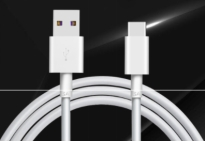                   |
| 28   | HX-2.54 5P DuPont Wire 100mm                | 1    | 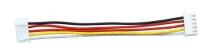                   |
| 29   | HX-2.54 4P DuPont Wire 50mm                 | 1    | 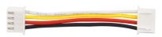                   |
| 30   | HX2.54mm-4P to 2.54 DuPont Wire 150mm       | 1    | 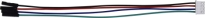                   |
| 31   | XH2.54 3P DuPont Wire 50mm                  | 2    |                    |
| 32   | Screwdriver                                 | 1    | 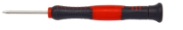                   |
| 33   | TT Coupling                                 | 4    | 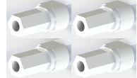 |
| 34   | M1.2*5mm Round Head Self-tapping Screw      | 6    | 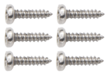 |
| 35   | Tracking Runway                             | 1    |                    |
| 36   | Winding Pipe                                | 1    | 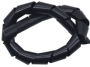                   |

## 1.4 Keyestudio UNO PLUS Development Board

You need to know that keyestudio UNO PLUS development board is the core of this 4WD Mecanum Robot Car.

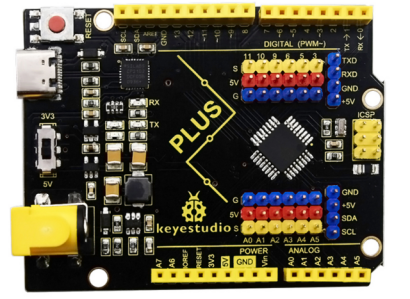

The core processor of the board is ATMEGA328P-AU, using a CP2102 chip as UART-to-USB converter. It has 14 digital input/output pins (of which 6 can be used as PWM outputs), 8 analog inputs, a serial port for communication, a 16 MHz crystal oscillator, a USB connection, a power jack, a ICSP plug as well as a reset button. 

It supports everything you need for a microcontroller. You can connect it to your computer with a USB cable and power it through an external power connector (DC 7-12V) to start using it.  

| Microcontroller   | ATMEGA328P-AU                                            |
| ----------------- | -------------------------------------------------------- |
| Operating Voltage | 5V                                                       |
| Input Voltage     | DC7-12V                                                  |
| Digital IO Pins   | 14 (D0-D13)                                              |
| PWM IO Pins       | 6 (D3，D5，D6，D9，D10，D11)                             |
| Analog Input Pins | 8(A0-A7)                                                 |
| Flash Memory      | 32 KB (ATMEGA328P-PU) of which 0.5 KB used by bootloader |
| SRAM              | 2 KB (ATMEGA328P-PU)                                     |
| EEPROM            | 1 KB (ATMEGA328P-PU)                                     |
| Clock Speed       | 16 MHz                                                   |

**Element and Interfaces**

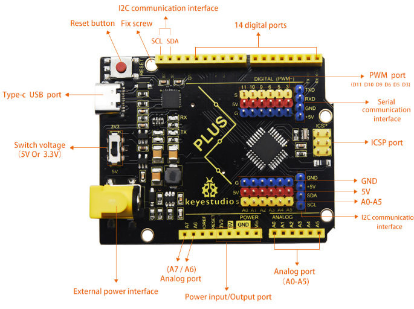

**UNO PLUS Board and UNO Board**

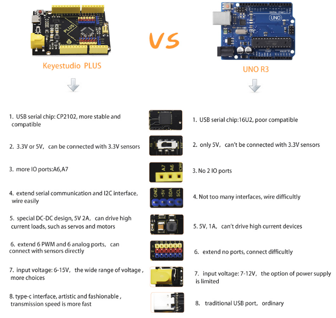

## 1.5 Keyestudio Sensor Shield V6 for Arduino

**1.Description**

Keyestudio Sensor Shield V6 for Arduino is suitable for UNO development board, which can be plugged into the UNO development board without the external power supply.

In the case of retaining the original IO port, the PH2.54 anti-reverse plug terminals are used, which lead to the IO port of the UNO development board. The PH2.54 plug avoids the wrong connection and protects the UNO motherboard and sensors. Furthermore, each IO port is equipped with independent VCC and GND interfaces in a way that make it easier for sensor connection. 

The interface of motors, seven-color LEDs and RGB on the car are drawn out, we solely need a wire with anti-reverse plug terminal from the interface on the corresponding bottom plate, which is simple and convenient. In addition, we also reserved some interfaces, IIC, UART, and WIFI interface. It must be noted that this board is powered by the base board 2PIN terminal 5V.

**2.Specifications**

- Current：The maximum is 1.2A (the maximum total current provided by IO of arduino UNO is 200mA, and the maximum is 1A for wifi module) 

- DC input voltage：5V
- Output voltage：DC 3.3V\5V
- Maximum power: 4.3W
- Recommended ambient temperature：-10°C ~ 50°C
- Dimension：70 * 55 * 27mm
- Weight: 25.5g

**3.Schematic Diagram**

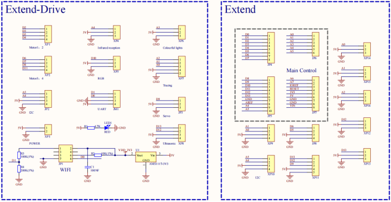

**4.Interface** 

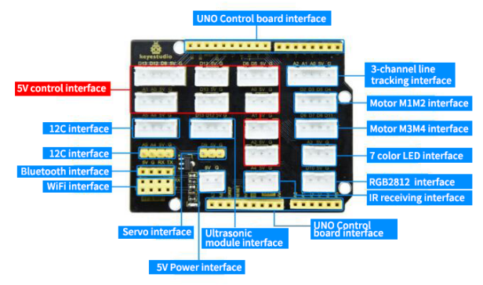

**5.Using Method**

Stack the expansion board on the Keyestudio UNO PLUS development board, as shown below:

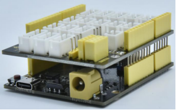

## 1.6 Keyestudio Mecanum Car Base Board

**1.Description**

The motor driver base board contains a STC8 chip and a DRV8833 chip, etc. In order to save IO ports , we will use part of the pins of the STC8 chip to control the DRV8833 chip, and the HR8833 chip is used to control the rotation direction and speed of four DC deceleration motors. 

The STC8 is equivalent to the IIC slave device with an 8-channel PWM output (register 0x1~8) and 2-channel digital signal output (register 0x9~A). When we enter the corresponding values to the corresponding register, the chip will output the corresponding signals from the corresponding pins. 

The board is also equipped with a 3-channel line tracking sensor, IR receivers, four WS2812 lights, two seven-color lights, four dc deceleration motors.（two seven-color lights have been linked to the pins of the STC8 chip, four motors driven by DRV8833 chips have also been linked to the STC8, the rest of the sensors are controlled by the pins of the control board).

The dc deceleration motor is gear deceleration motor, which is based on the ordinary DC motors, and plus the gear reduction box. The box empowers to provide a lower speed and a stronger torque. 

At the same time, the gearbox of different reduction ratio can provide different speed and torque, making the dc motors used more frequently in the automation industry. What’s more, the dc deceleration motors are widely used in iron and steel industry as well as machinery industry, etc

**2.Specifications**

- Connector port input: DC 6V---9V 
- Operating voltage of driver board system: 5V 
- Standard operating power consumption: about 2.2W 
- Maximum power: 12W 
- Motor speed: 200RPM
- Working temperature range: 0-50℃ 
- Dimension: 120*120*120mm 
- Environmental protection attributes: ROHS 

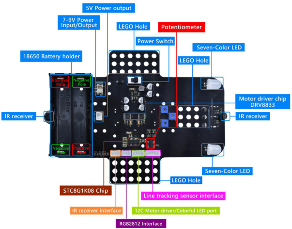

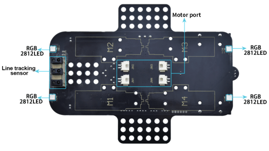

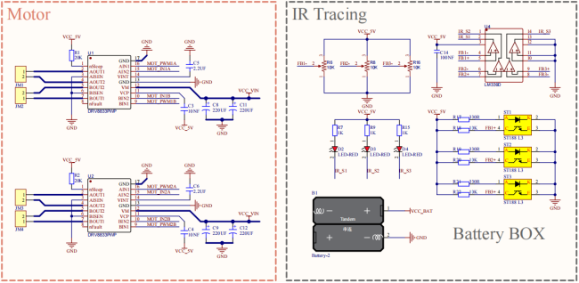

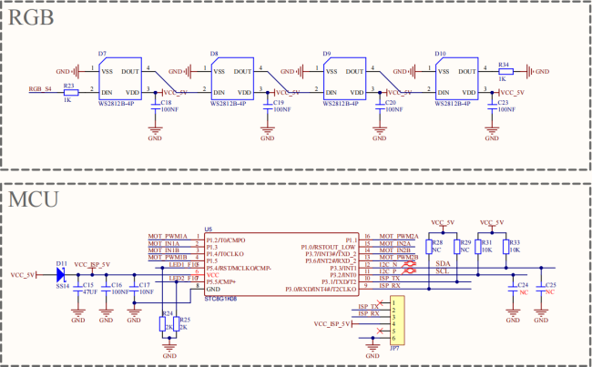

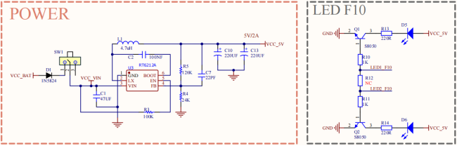

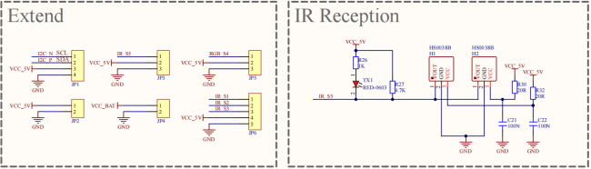