# 2. Product installation

### Part 1

**Components Needed**

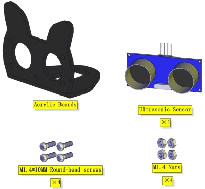

**Installation Diagram**

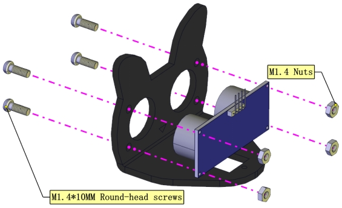

**Prototype**

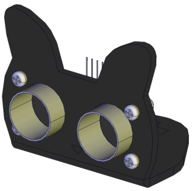

### Part 2

**Components Needed**

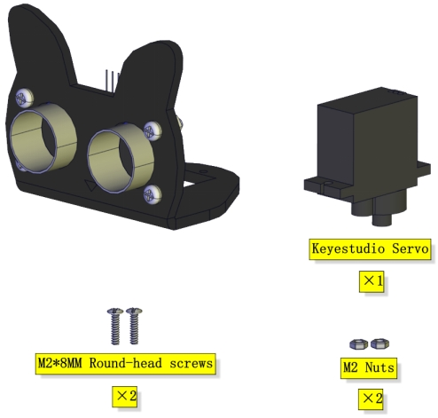

**Installation Diagram**

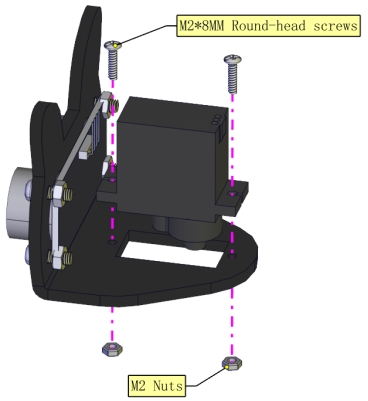

**Prototype**

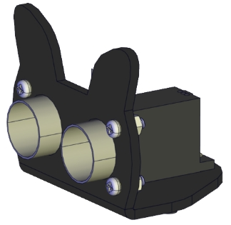

### Part 3

**Components Needed**

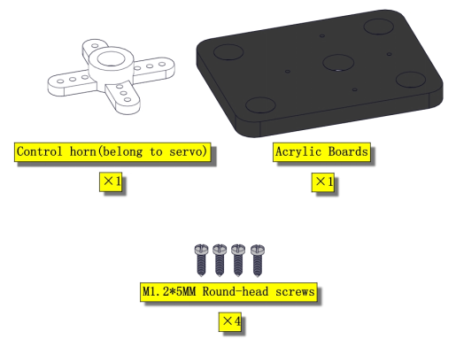

**Installation Diagram**

**Prototype**

### Part 4

**Set the angle of the servo to 90°**

| Servo  | Expansion Board |
| ------ | --------------- |
| Brown  | G               |
| Red    | 5V              |
| Yellow | D9              |

To adjust the code of the servo,please select it according to the course.

1.**Arduino:**Download the code file:[Arduino](./Arduino.7z)

2.**Kidsblock:**Download the code file:[Kidsblock](./Kidsblock.7z)

**Components Needed**

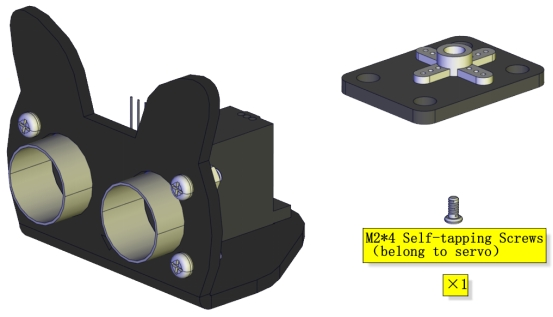

**Installation Diagram(mind the installation direction)**

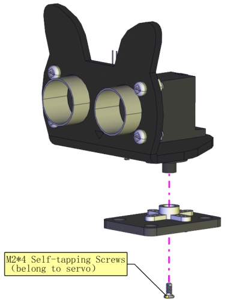

**Prototype**

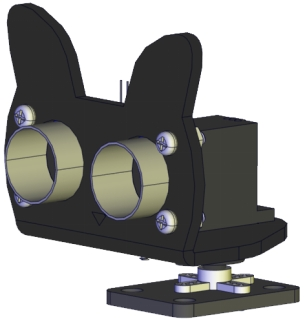

### Part 5

**Components Needed**

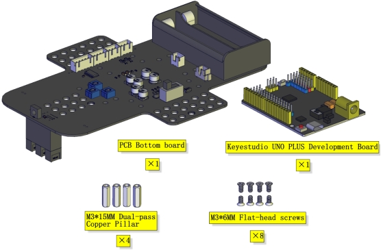

**Installation Diagram**

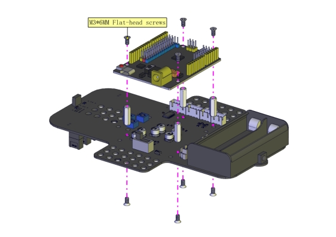

**Prototype**

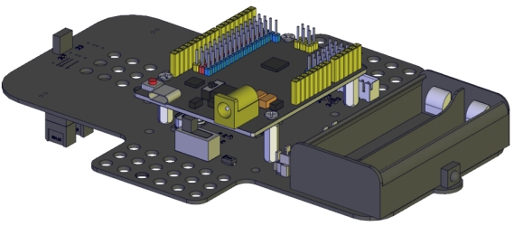

### Part 6

**Components Needed**

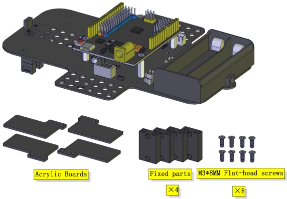

**Installation Diagram**

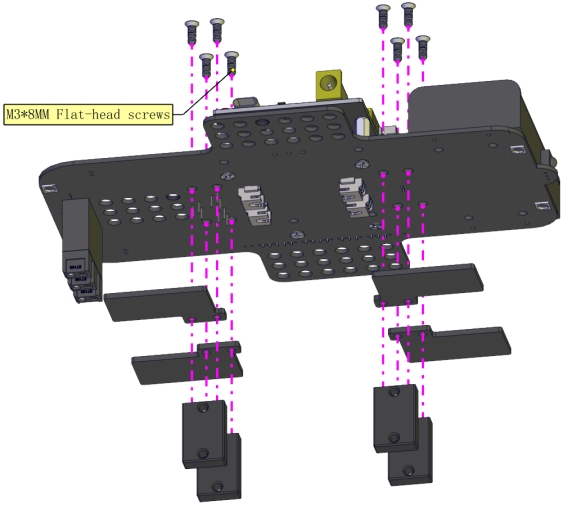

**Prototype**

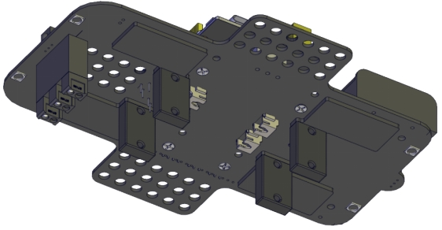

### Part 7

**Components Needed**

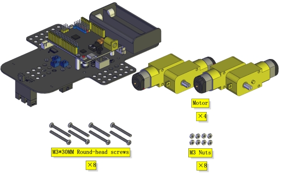

**Installation Diagram(mind the direction of the motor)**

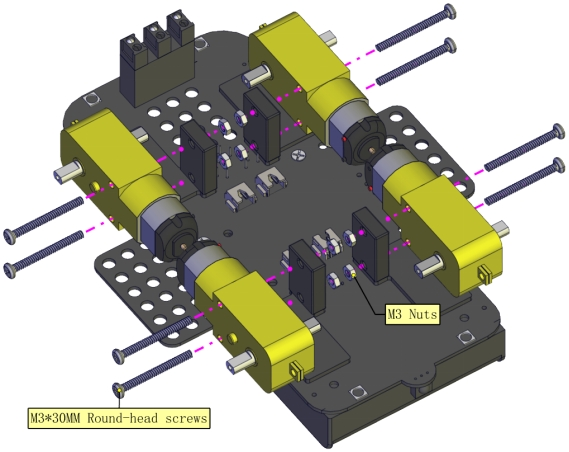

**Prototype**

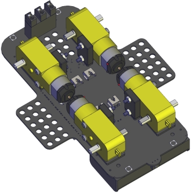

### Part 8

**Components Needed**

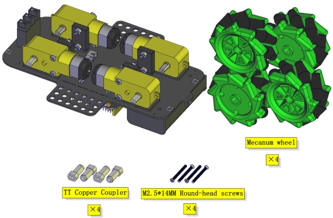

**Installation Diagram**

**(Pay attention to the  installation direction of the mecanum wheels)**

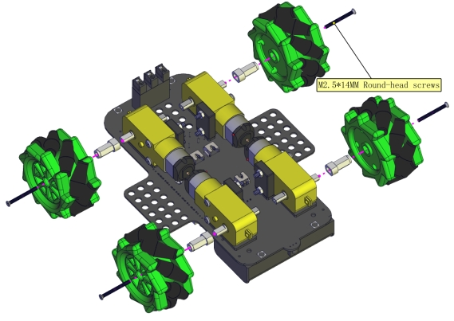

**Prototype**

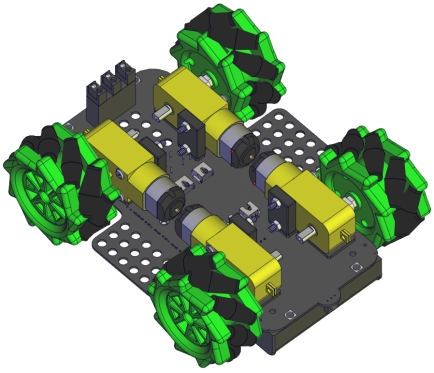

### Part 9

**Components Needed**

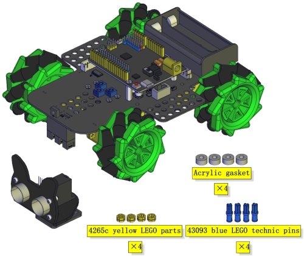

**Installation Diagram**

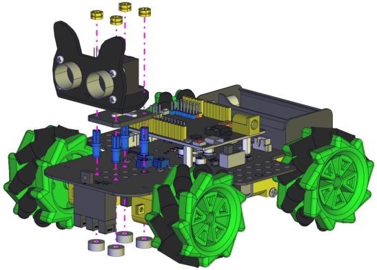

**Prototype**

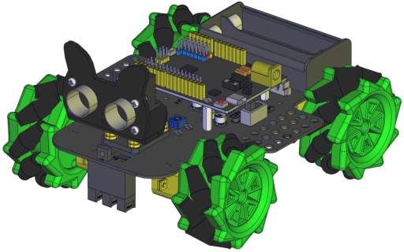

### Part 10

**Components Needed**

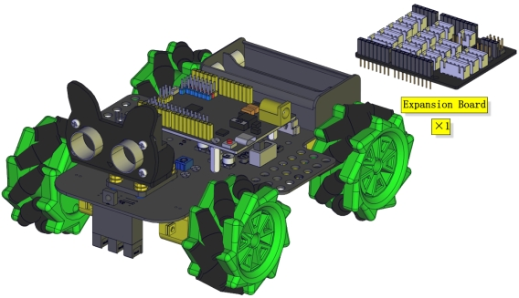

**Installation Diagram**

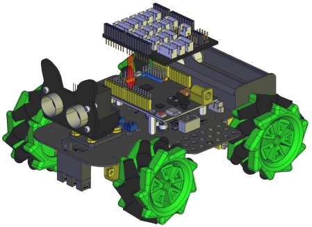

**Prototype**

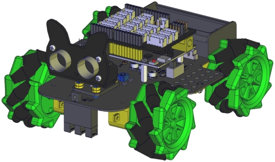

**Insert a Bluetooth module**

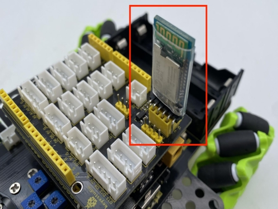

### Wiring Diagram

**The wiring of the ultrasonic module**

| ultrasonic | Sensor expansion board |
| ---------- | ---------------------- |
| Vcc        | V                      |
| Trig       | D12                    |
| Echo       | D13                    |
| Gnd        | G                      |

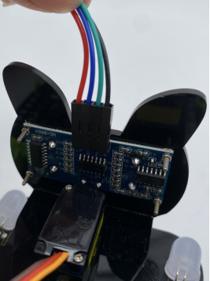

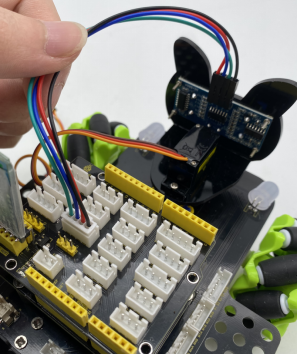

**The wiring of the servo**

| Servo  | Sensor expansion board |
| ------ | ---------------------- |
| Brown  | G                      |
| Red    | 5V                     |
| Orange | D9                     |

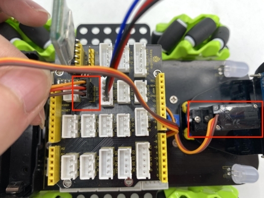

**The wiring of controlling the IR receiver**

| Driver Board | Expansion Board |
| ------------ | --------------- |
| GND          | G               |
| 5V           | 5V              |
| S5           | A3              |

**The wiring of controlling the RGB2812 LED**

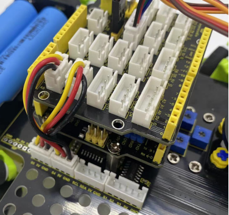

| Driver Board | Expansion Board |
| ------------ | --------------- |
| GND          | G               |
| 5V           | 5V              |
| S4           | D10             |

**The wiring of controlling motors and 7-color LEDs**

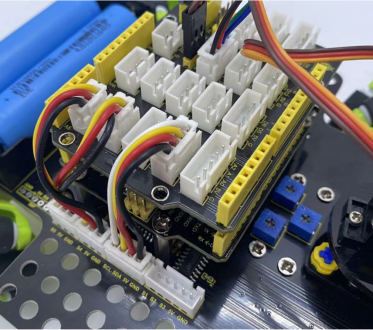

| Driver Board | Expansion Board |
| ------------ | --------------- |
| SCL          | D2              |
| SDA          | D3              |
| 5V           | D5              |
| GND          | D4              |

**The wiring of controlling the line-tracking sensor**

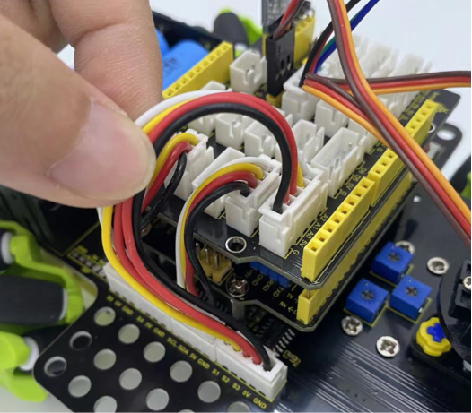

| Driver Board | Expansion Board |
| ------------ | --------------- |
| S1           | A2              |
| S2           | A1              |
| S3           | A0              |
| 5V           | 5V              |
| GND          | G               |

**Connect the motors to the corresponding interface as shown in the figure**

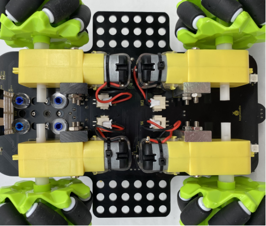

**Installation of batteries**

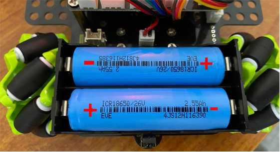