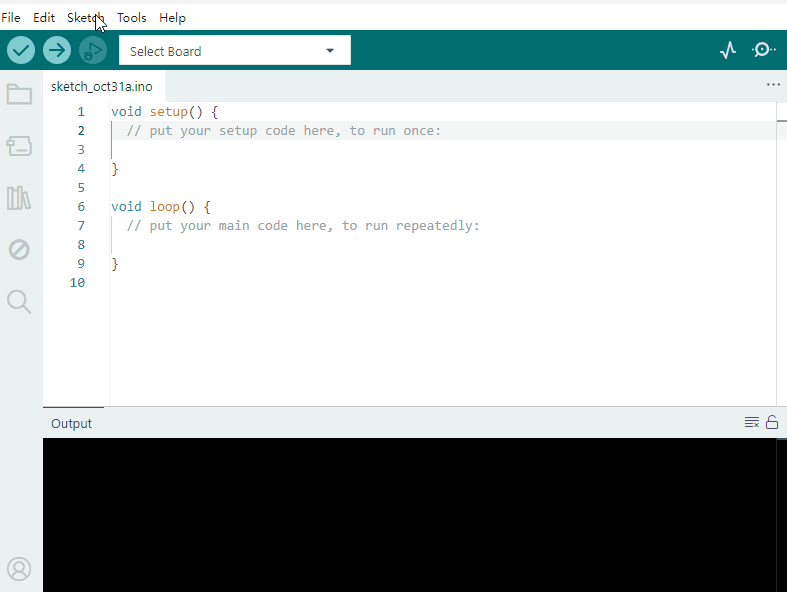

3. Arduino Tutorial
===================

3.1 Data download
-----------------

Arduino information contains library files and project code ,please
click to download for follow-up study.

Data download:  :download:`Arduino <./Arduino.7z>`

APP download:

**Android:** https://xiazai.keyesrobot.cn/APP/Mecanum%20Robot.apk

**Google:**
https://play.google.com/store/apps/details?id=com.keyestudio.mecanum_robot

**Apple Store:**
https://apps.apple.com/cn/app/mecanum-robot/id1582947578

3.2 Software Download
---------------------

Open the browser and search: https://www.arduino.cc/en/software, we will
take WINDOWS system as an example to show you how to download and
install.

|image1|

You just need to click JUSTDOWNLOAD,then click the downloaded file to
install it.And when the ZIP file is downloaded,you can directly unzip
and start it.

|image2|

3.3 Set Arduino IDE
-------------------

Connecting the board to the computer.

|image3|

3.4 Add Library
---------------

Open the Arduino IDE, follow [Sketch] → [Include Library] → [Add .zip
Library]. This method can only import one library file at a time. If the
product has multiple libraries, please import them one by one following
this process!

|image4|

3.5 Project
-----------

.. toctree::
    :maxdepth: 1

    Project/Project1
    Project/Project2
    Project/Project3
    Project/Project4
    Project/Project5
    Project/Project6
    Project/Project7
    Project/Project8
    Project/Project9
    Project/Project10
    Project/Project11
    Project/Project12

.. |image1| image:: media/1.gif
.. |image2| image:: media/2.gif
.. |image3| image:: media/Anima.gif

