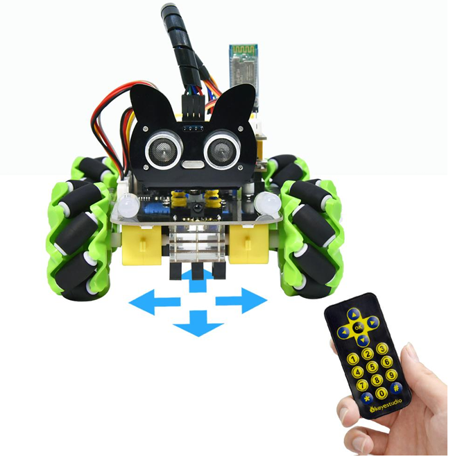
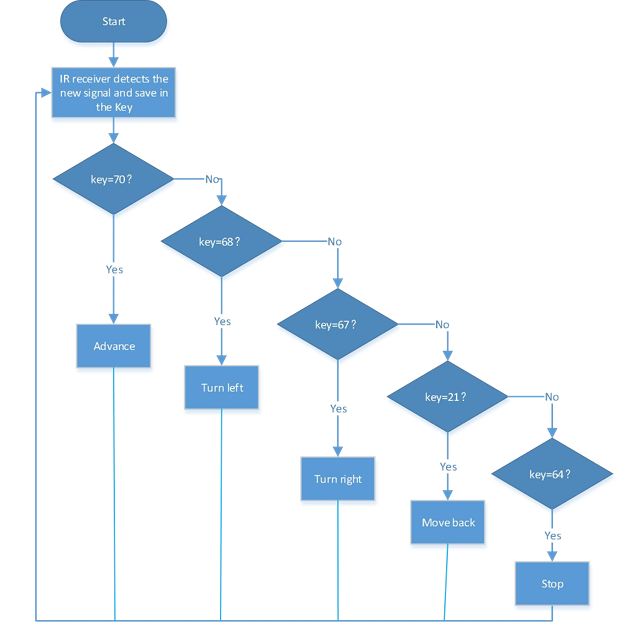

### Project 11 IR Remote Control Smart Car



**1.Description**

 In this project, we will work to control the car using an IR remote control.

**2.Flow Diagram**



**3.Test Code**

```
#include "MecanumCar_v2.h"
mecanumCar mecanumCar(3, 2);  //sda-->D3,scl-->D2
#include "ir.h"
IR IRreceive(A3);//IR receiver is connected to A3

void setup()
{
  Serial.begin(9600); //Set baud rate to 9600
  mecanumCar.Init(); //Initialize the seven-color LED and motor drive
}

void loop() 
{
  int key = IRreceive.getKey();
  if (key != -1) 
  {
    Serial.println(key);
    switch (key)
    {
      case 64: mecanumCar.Stop();       break;  //Stop
      case 70: mecanumCar.Advance();    break;  //Advance
      case 21: mecanumCar.Back();       break;  //Move back
      case 68: mecanumCar.Turn_Left();  break;  //Turn left
      case 67: mecanumCar.Turn_Right(); break;  //Turn right
    }
  }
}
```

**4.Test Result**

After uploading the test code and turning the DIP switch to the ON end and powering up. When we press the button on the remote control, the car moves forward, then ,,the car turns left,,the car moves back,,the car turns right,,the car stops.

**5.Code Explanation**

```
switch (key)
{
	case num: ...... break;
}
// The switch statement, used with case, executes the statement after case when the variable in parentheses is the value after case.
```

```
case 64: mecanumCar.Stop();  //The car will stop
```

```
case 70: mecanumCar.Advance();   //The car will go forward
```

```
case 21: mecanumCar.Back();  //The car will move back
```

```
case 68: mecanumCar.Turn_Left();  //The car will turn left
```

```
case 67: mecanumCar.Turn_Right(); //The car will turn right
```


