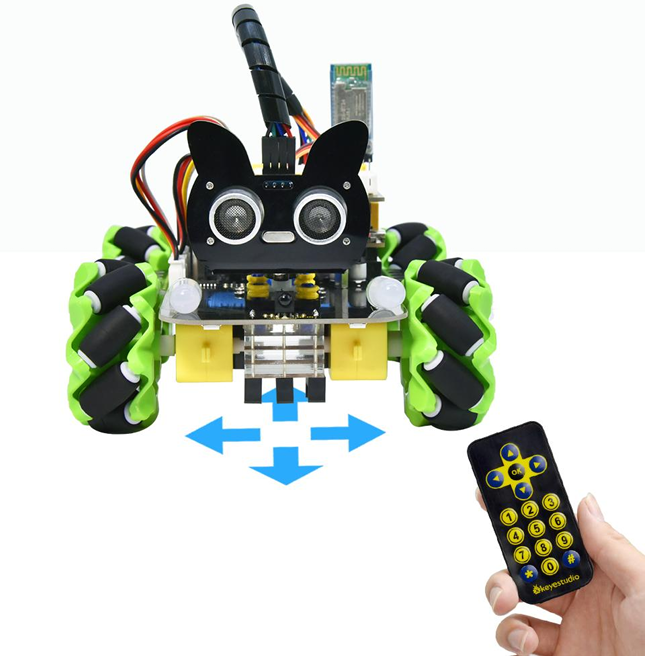
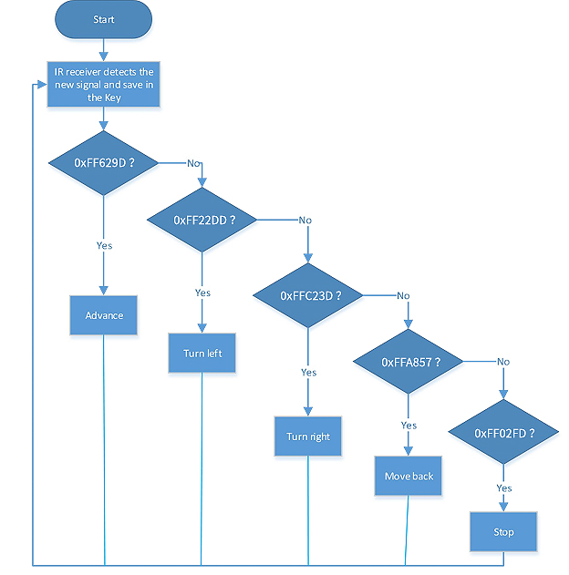

### Project 11 IR Remote Control Smart Car



**1.Description**

 In this project, we will work to control the car using an IR remote control.

**2.Flow Diagram**



**3.Test Code**

```
#include <MecanumCar_v2.h>
mecanumCar mecanumCar(3, 2);  //sda-->D3,scl-->D2
#include <IRremote.h>
/****Introduce the infrared remote control header file***/

int RECV_PIN = A3;
IRrecv irrecv(RECV_PIN);
decode_results results;

void setup()
{
  Serial.begin(9600); //Set baud rate to 9600
  mecanumCar.Init(); //Initialize the seven-color LED and motor drive
  irrecv.enableIRIn(); 
}

void loop() {
  if (irrecv.decode(&results)) {
    Serial.println(results.value, HEX);
    switch (results.value)
    {
      case 0xFF02FD: mecanumCar.Stop();       break;  //Stop
      case 0xFF629D: mecanumCar.Advance();    break;  //Advance
      case 0xFFA857: mecanumCar.Back();       break;  //Move back
      case 0xFF22DD: mecanumCar.Turn_Left();  break;  //Turn left
      case 0xFFC23D: mecanumCar.Turn_Right(); break;  //Turn right
    }
    irrecv.resume(); // Receive the next value
  }
}
```

**4.Test Result**

After uploading the test code and turning the DIP switch to the ON end and powering up. When we press the button on the remote control, the car moves forward, then ,,the car turns left,,the car moves back,,the car turns right,,the car stops.

