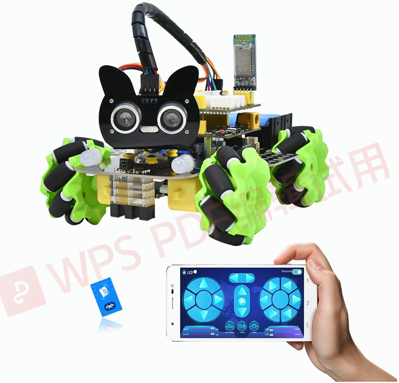
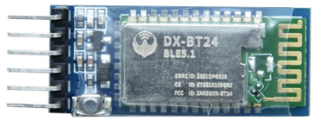
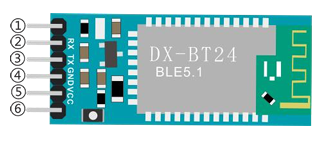
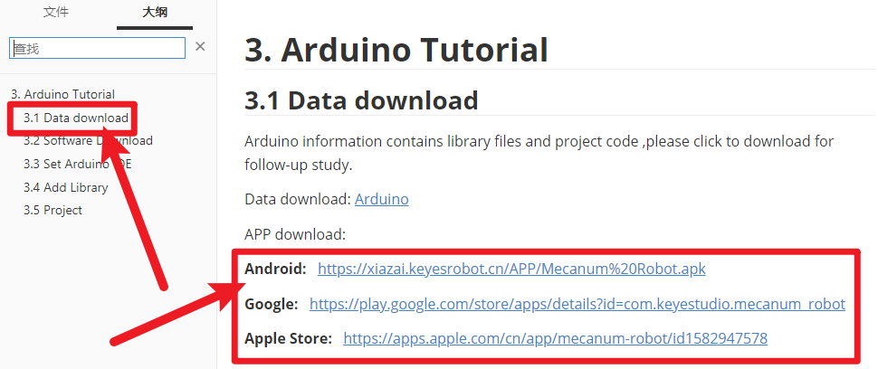
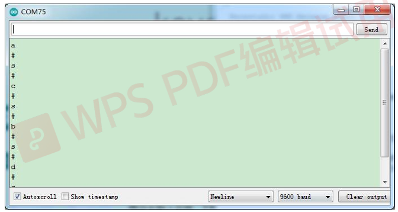
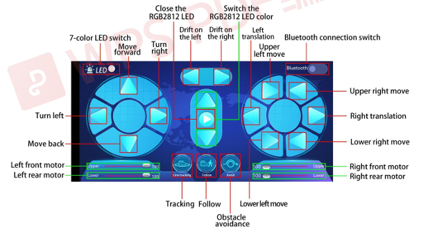

### Project 12 Bluetooth Control Smart Car



**1.Description**



There is a DX-BT24 5.1 Bluetooth module in this kit. This Bluetooth module comes with 256Kb space and complies with V5.1 BLE Bluetooth specification, which supports AT commands. Users can change parameters such as the baud rate and device name of the serial port as required.

Furthermore, it supports UART interface and Bluetooth serial port transparent transmission, which also contains the advantages of low cost, small size, low power consumption and high sensitivity for sending and receiving. Notably, it solely needs a few peripheral components to realize its powerful functions.

In this project, we will use the BT24 Bluetooth module to combine all modules of the car in one code, which contains all functions except IR remote control mentioned in the previous projects. We plan to use mobile APP to connect Bluetooth module, so as to control various functions, which is distinctly simple and convenient.

We will work to read the control characters sent by each button through the Bluetooth connection of the APP.

**2.Parameters**

- Bluetooth protocol： Bluetooth Specification V5.1 BLE 
- Working frequency：2.4GHz ISM band 
- Communication interface： UART 
- Power supply：5V/3.3V 
- Communication distance: 40m 
- Dimension：27(L)mm x 13 (W)mm x 2(H) mm
- Bluetooth name：BT24
- Serial port parameters：9600、eight data bits, one stop bit, no check, no flow control
- Working temperature： MIN:-40℃- MAX:+85℃

The DX-BT24 module also supports the BT5.1 BLE protocol, which can be directly connected to iOS devices with BLE Bluetooth function, and supports resident running of background programs. It is mainly used in the field of short-distance data wireless transmission. It enables to avoid cumbersome cable connections and can directly replace serial cables. Successful application areas of BT24 modules:



 ※ Bluetooth wireless data transmission; 

※ Mobile phone, computer peripheral equipment; 

※ Handheld POS equipment; 

※ Wireless data transmission of medical equipment; 

※ Smart home control; 

※ Bluetooth printer; 

※ Bluetooth remote control toys; 

※ Shared bicycles;

 **Ports**

①STATE： Status pin 

②RX： Receiving pin

③TX： sending pin 

④GND：GND 

⑤VCC： Power 

⑥EN： Enable pin

**Connect the BT module to the development board.**

| Uno  | BT24 |
| ---- | ---- |
| TX   | RX   |
| RX   | TX   |
| VCC  | 5V   |
| GND  | GND  |

**3.APP**

Please download the app here.



**4.Test Code**

```
void setup() 
{
  Serial.begin(9600);//Start the serial monitor and set the baud rate to 9600
}

void loop() 
{
  if (Serial.available())//If the receiving area is not empty
  {
    char ble_val = Serial.read();//Read the data of the bluetooth
    Serial.println(ble_val);//The serial monitor prints the read data
  }
}
```

**5.Test Result**

After uploading the code, plug in the Bluetooth, be careful not to plug it upside down. Connect the Bluetooth module and turn on the serial monitor.

Aim at the Bluetooth module and press the APP button of the mobile phone. We can see the corresponding control characters of the APP button, as shown below.



**6.Code Explanation**

```
Serial1.begin(9600); //Set the baud rate of the Bluetooth serial port to 9600. (Serial port 0 corresponds to Serial1, serial port 1 corresponds to Serial2 ).
```

```
Serial1.available();   //If Bluetooth data is received, this value is not 0.
```

```
char ble_val = Serial1.read(); //Read Bluetooth serial port data and define a variable of type char to save.
```

```
Serial.println(ble_val);
Serial1.println(ble_val);
// Upper : output to serial monitor;Lower: output data to Bluetoot module.
```

```
Serial1.readStringUntil('#'); //Read the Bluetooth strings, stop reading if "#" appears, note that we use two consecutive such statements, because when we adjust speed, sending strings such as V# 50#, we first read is "V" (#,then stop), the second read is"50", read here is string instead of an integer value.
```

```
String(speed_str).toInt();   // Convert the numeric string read to an integer value.
```

```
map(speed_Upper_L, 0, 100, 0, 255);  //Since the speed value we send on our APP is 0~100, we have to map it to 0~ 255.
```

```
speed_Upper_L
speed_Lower_L
speed_Upper_R
speed_Lower_R   //Represents the speed values of the four motors.Range is 0~255
```

**7.Comprehensive Project APP Control Smart Car**

```
#include "MecanumCar_v2.h"
#include <Adafruit_NeoPixel.h>
#include "Servo.h"
#include "ir.h"

mecanumCar mecanumCar(3, 2);  //sda-->D3,scl-->D2
//Creat a class called rgb_2812 to control rgb,there are four LEDs and the pins are connected to D10
Adafruit_NeoPixel rgb_2812 = Adafruit_NeoPixel(4, 10, NEO_GRB + NEO_KHZ800);
Servo myservo;

/*******Ultrasonic Sensor interface*****/
#define EchoPin  13  //ECHO to D13
#define TrigPin  12  //TRIG to D12

/********Define the pin of line tracking sensor**********/
#define SensorLeft    A0   //input pin of left sensor
#define SensorMiddle  A1   //input pin of middle sensor
#define SensorRight   A2   //input pin of right sensor

String speed_str1 = "0";

String speed_str2 = "0";
int color_num = 0;
char ble_val;

void setup() {
  Serial.begin(9600);  //Set the Bluetooth string baud rate to 9600
  pinMode(EchoPin, INPUT);    //The ECHO pin is set to input mode
  pinMode(TrigPin, OUTPUT);   //The TRIG pin is set to output mode

  /****All interfaces of the line tracking sensor are set to input mode***/
  pinMode(SensorLeft, INPUT);
  pinMode(SensorMiddle, INPUT);
  pinMode(SensorRight, INPUT);
  myservo.attach(9);  // attaches the servo on D9 to the servo object
  myservo.write(90);
  delay(500);

  rgb_2812.begin();   //Start rgb2818
  rgb_2812.setBrightness(255);  //Initialize the brightness(0~255)
  rgb_2812.show();   //Initializing a refresh
  mecanumCar.Init(); //Initialize the seven-color LED and motor drive
}

void loop() {
  if (Serial.available())//If the receiving area is not empty
  {
    ble_val = Serial.read();//Read the data of the bluetooth
    Serial.println(ble_val);//The serial monitor prints the read data
    switch (ble_val)
    {
      /*********************The car driving************************/
      case 's': mecanumCar.Stop();       break;  //Stop
      case 'a': mecanumCar.Advance();    break;  //Go ahead
      case 'c': mecanumCar.Back();       break;  //Move back
      case 'b': mecanumCar.Turn_Left();  break;  //Turn left
      case 'd': mecanumCar.Turn_Right(); break;  //Turn right
      case 'k': mecanumCar.L_Move();     break;  //Left shift
      case 'h': mecanumCar.R_Move();     break;  //Right shift
      case 'l': mecanumCar.LU_Move();    break;  //Upper left move
      case 'j': mecanumCar.LD_Move();    break;  //lower left move
      case 'g': mecanumCar.RU_Move();    break;  //Upper right move
      case 'i': mecanumCar.RD_Move();    break;  //lower right move
      case 'e': mecanumCar.drift_left(); break;  //Drift
      case 'f': mecanumCar.drift_right(); break; //Drift

      case 'p': Line_Tracking();   break;  //Tracking
      case 'q': ult_following();   break;  //Follow
      case 'r': ult_avoiding();    break;  //Obstacle Avoidance

      /*********************The light of the car*************************/
      case 't': mecanumCar.right_led(1);  mecanumCar.left_led(1); break;  //Open the 7-color LED
      case 'u': mecanumCar.right_led(0);  mecanumCar.left_led(0); break;  //Close the 7-color LED
      case 'm': color_num++; showColor(); break;  //Switching the color of 2812 LED
      case 'o': rgb_2812.clear(); rgb_2812.show(); break;  //Close the 2812 LED
      case 'n': color_num--; showColor(); break;  //Switching the color of 2812 LED
      /*********************The car changes speed**************************/
      case 'v':   /*Read left front motor M2 speed*/
        speed_str1=Serial.readStringUntil('#');   //Save the speed data read for the first time
        speed_str2 = Serial.readStringUntil('#');   //Save the speed data read for the second time
        speed_Upper_L = String(speed_str2).toInt();      //The speed value is a string and needs to be converted to an integer
        speed_Upper_L = map(speed_Upper_L, 0, 100, 0, 255);  //Mapping from 0 to 100 to 0 to 255
        //Serial.println(speed_Upper_L);  //Serial debugging
        break;
      case 'w':   /*Read left rear M3 motor speed*/
        speed_str1=Serial.readStringUntil('#');
        speed_str2 = Serial.readStringUntil('#'); 
        speed_Lower_L = String(speed_str2).toInt();
        speed_Lower_L = map(speed_Lower_L, 0, 100, 0, 255);
        //Serial.println(speed_Lower_L);
        break;
      case 'x':   /*Read right front M1 motor speed*/
        speed_str1=Serial.readStringUntil('#');
        speed_str2 = Serial.readStringUntil('#'); 
        speed_Upper_R = String(speed_str2).toInt();
        speed_Upper_R = map(speed_Upper_R, 0, 100, 0, 255);
        //Serial.println(speed_Upper_R);
        break;
      case 'y':   /*Read right rear M4 motor speed*/
        speed_str1=Serial.readStringUntil('#');
        speed_str2 = Serial.readStringUntil('#'); 
        speed_Lower_R = String(speed_str2).toInt();
        speed_Lower_R = map(speed_Lower_R, 0, 100, 0, 255);
        //Serial.println(speed_Lower_R);
        break;

      default: break;
    }
  }
}


/*********************RGB2812 display*******************************/
void showColor() { 
  //  Serial.print("color num:"); //Serial debugging
  //  Serial.println(color_num);
  //  There are only 7 colors, you can add them yourself
  if (color_num > 6)color_num = 0;
  if (color_num < 0)color_num = 6;
  switch (color_num) {
    case  0:
      for (int i = 0; i < 4; i++) {
        rgb_2812.setPixelColor(i, 255, 0, 0);  //The iLED is red
      }
      break;
    case  1:
      for (int i = 0; i < 4; i++) {
        rgb_2812.setPixelColor(i, 255, 80, 0); //The iLED is orange
      }
      break;
    case  2:
      for (int i = 0; i < 4; i++) {
        rgb_2812.setPixelColor(i, 255, 255, 0); //The iLED is yellow
      }
      break;
    case  3:
      for (int i = 0; i < 4; i++) {
        rgb_2812.setPixelColor(i, 0, 255, 0);   //The iLED is green
      }
      break;
    case  4:
      for (int i = 0; i < 4; i++) {
        rgb_2812.setPixelColor(i, 0, 0, 255);   //he iLED is blue
      }
      break;
    case  5:
      for (int i = 0; i < 4; i++) {
        rgb_2812.setPixelColor(i, 0, 255, 255); //The iLED is indigo
      }
      break;
    case  6:
      for (int i = 0; i < 4; i++) {
        rgb_2812.setPixelColor(i, 160, 32, 240);//The iLED is purple
      }
      break;
    default : break;
  }
  rgb_2812.show();                        //Refresh display
}

/*********************Line Tracking*******************************/
void Line_Tracking(void) {   //Tracking black line
  while (1)
  {
    uint8_t SL = digitalRead(SensorLeft);   //Read the value of the left line tracking sensor
    uint8_t SM = digitalRead(SensorMiddle); //Read the value of the middle line tracking sensor
    uint8_t SR = digitalRead(SensorRight);  //Read the value of the right line tracking sensor
    if (SM == HIGH) {
      if (SL == LOW && SR == HIGH) {  // black on right, white on left, turn right
        mecanumCar.Turn_Right();
      }
      else if (SR == LOW && SL == HIGH) {  // black on left, white on right, turn left
        mecanumCar.Turn_Left();
      }
      else {  // white on both sides, going forward
        mecanumCar.Advance();
      }
    }
    else {
      if (SL == LOW && SR == HIGH) { // black on right, white on left, turn right
        mecanumCar.Turn_Right();
      }
      else if (SR == LOW && SL == HIGH) {  // white on right, black on left, turn left
        mecanumCar.Turn_Left();
      }
      else { // all white, stop
        mecanumCar.Stop();
      }
    }
    if (Serial.available())//If the receiving area is not empty
    {
      ble_val = Serial.read();//Read Bluetooth data
      if (ble_val == 's') {
        mecanumCar.Stop();
        break;
      }
    }
  }
}


/*********************Ultrasonic Following*******************************/
void ult_following(void)
{
  while (1)
  {
    int distance = get_distance();  //Get the distance and save in the distance variable
    //Serial.println(distance);
    if (distance <= 15)  //The range of moving back

    {
      mecanumCar.Back();
    }
    else if (distance <= 25)  //The range of stop
    {
      mecanumCar.Stop();
    }
    else if (distance <= 45) //The range of advance  
    {
      mecanumCar.Advance();
    }
    else  //Other cases stop
    {
      mecanumCar.Stop();
    }
    if (Serial.available())//If the receiving area is not empty
    {
      ble_val = Serial.read();//Read Bluetooth data
      if (ble_val == 's') {
        mecanumCar.Stop();
        break;
      }
    }
  }
}


/*********************Ultrasonic obstacle avoidance*******************************/
void ult_avoiding(void)
{
  int distance_M, distance_L, distance_R;
  while (1)
  {
    distance_M = get_distance();  //Get the distance and save in the distance variable
    if (distance_M < 20) {//When the distance in front is less than 20cm
      mecanumCar.Stop();  //Robot stops
      delay(500); //Delay in 500ms
      myservo.write(180);  //Ultrasonic cradle head turns left
      delay(500); //Delay in 500ms
      distance_L = get_distance();  //Assign the left ultrasonic distance to variable a1
      delay(100); //Read values when stable
      myservo.write(0); //Ultrasonic cradle head turns right
      delay(500); //Delay in 500ms
      distance_R = get_distance(); //Assign the right ultrasonic distance to variable a2
      delay(100); //Read values when stable

      myservo.write(90);  //Return to the 90 degree position
      delay(500);
      if (distance_L > distance_R) { //When the distance on the left is greater than right
        mecanumCar.Turn_Left();  //Robot turns left
        delay(300);  //Turn left 700ms
   
      } else {
        mecanumCar.Turn_Right(); //Robot turns right
        delay(300);
      }
    }
    else { //If the distance in front is >=20cm, the robot will advance
      mecanumCar.Advance(); //Advance
    }
    if (Serial.available())//If the receiving area is not empty
    {
      ble_val = Serial.read();//Read Bluetooth data
      if (ble_val == 's') {
        mecanumCar.Stop();
        break;
      }
    }
  }
}


/**********************Ultrasonic detects the distance*******************************/
int get_distance(void) {    //Ultrasonic detects the distance 
  int dis;
  digitalWrite(TrigPin, LOW);
  delayMicroseconds(2);
  digitalWrite(TrigPin, HIGH); //Give the TRIG a high level at least 10 µ s to trigger
  delayMicroseconds(10);
  digitalWrite(TrigPin, LOW);
  dis = pulseIn(EchoPin, HIGH) / 58.2; //Work out the distance
  delay(30);
  return dis;
}
```

After uploading the code successfully, turn the DIP switch to the ON end and powerup, plug in the bluetooth, then connect it to BT24. We can do the following operations:

Click to open the 7-color LED, click it again the LED will be turned off.

Click  to enter tracking mode, click it again will exit the mode.

Clickto enter follow mode, click it again will exit the mode.

Clickto enter obstacle avoidance mode, click it again will exit the  mode.

Pulling these two strips will change the speed of the two motors on the left and the same operation on the right.

 These buttons are used to switch the color of the four 2812 LEDs under the base board, and the middle button is used to close the function.

The rest of the buttons are all used to drive the car, but unlike the other buttons, they drive when we press them and stop when we release them.


