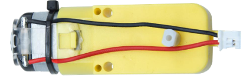
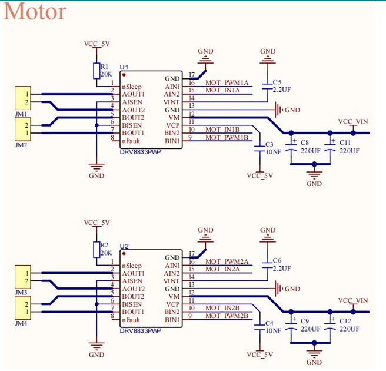
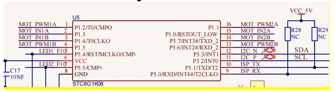

### Project 4 DC Reduction Motor

**1.Description**



The kit is equipped with 4 DC reduction motors, which are developed on the ordinary DC motors. It has a matching gear reduction box which provides a lower speed but a larger torque. Furthermore, different reduction ratios of the box can provide different speeds and torques.

The reduction motor is the integration of gearmotor and motor, which is applied widely in steel and machine industry.

The current of the motor driver is relatively large. If we use the IO port to force the motor to drive, either the motor will not rotate or the IO port will be burned, thereby it entails a motor driver chip. The DRV8833 motor driver chip has been included on the motor driver base board, which is used to control the rotation direction and speed of the 4 DC reduction motors. The circuit schematic diagram of the two chips are as below:

**2.Component Knowledge**





 Each chip controls 4pins, and 2 pins control one motor.

**3.Test Code**

```
#include "MecanumCar_v2.h"
mecanumCar mecanumCar(3, 2);  //sda-->D3,scl-->D2

void setup() 
{
  mecanumCar.Init();  //Initialize the drive
}

void loop() 
{
  mecanumCar.Advance();
  delay(2000);            //Wait for 2s
  
  mecanumCar.Back();      //Move back
  delay(2000);
  
  mecanumCar.Turn_Left(); //Turn left
  delay(2000);

  mecanumCar.Turn_Right();//Turn right
  delay(2000);

  mecanumCar.Stop();      //Stop
  delay(1000);
}
```

**4.Test Result**

First make sure the library files are installed, otherwise the code will fail to compile. Here we use the library file MecanumCar_v2, please refer to the development environment configuration for installation. After compiling and uploading the code, turn the DIP switch to the ON end and power on, and we can see that the car goes forward for 2s,goes back for 2s, turns left for 2s,turns right for 2s and then stops for 1s.

**5.Code Explanation**

```
#include "MecanumCar_v2.h"  //Import the MecanumCar_v2 file.
```

```
mecanumCar(sda,scl);// Create an instance to drive the motor and seven-colorlights，sda is connected to D3,scl is connected to D2.
```

```
mecanumCar.Init(); // Initialize the car driver.
```

```
mecanumCar.Advance();// 4 motors and the car go forward.
```

```
mecanumCar.Back();//4 motors the car move back.
```

```
mecanumCar.Turn_Left();// The left motors move back, the right motors turn forward and the car turnsleft.
```

```
mecanumCar.Turn_Right();//The left motors turn forward,the right motors move back and the car turns right.
```

```
mecanumCar.Stop();// 4 motors and the car stop.
```

```
delay(2000);//Wait for 2s
```