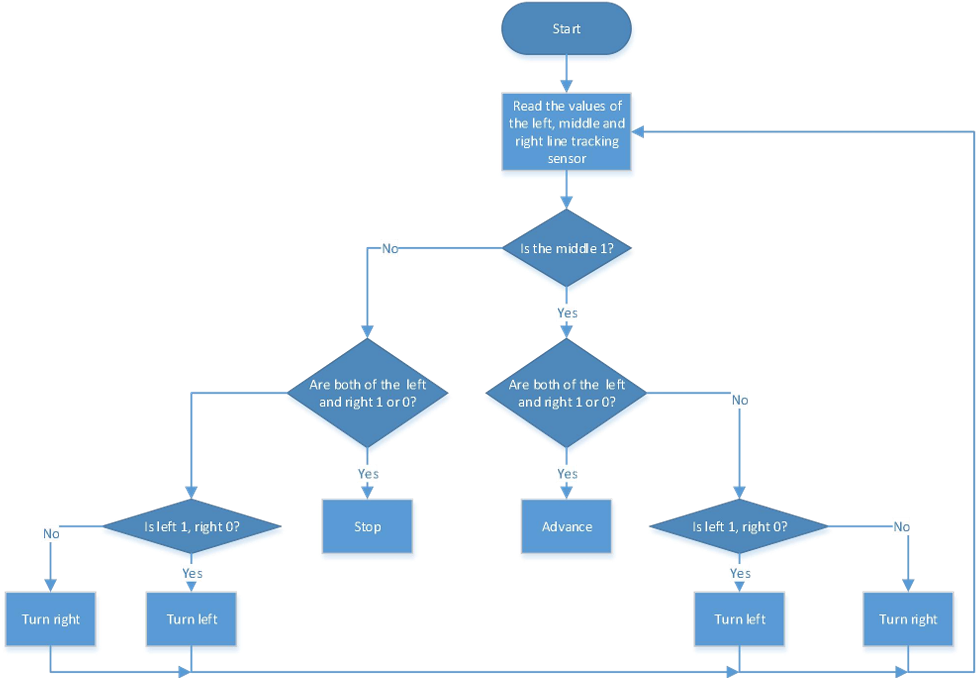

### Project 6 Line Tracking Smart Car

**1.Description**

In this project we will make a line tracking smart car. It works to use a line tracking sensor to detect the black track of the road, and the road surface detection signal is fed back to the control board. The control board analyzes andjudges the collected signals, and timely controls the motor to adjust the direction of the car, making the car run automatically along the black track  to realize the purpose of automatic tracking of the car.

**2.Flow Diagram**



 **3.Test Code**

```
#include "MecanumCar_v2.h"
mecanumCar mecanumCar(3, 2);  //sda-->D3,scl-->D2

/*******Define the pin of Line Tracking Sensor**********/
#define SensorLeft    A0   //input pin of left sensor
#define SensorMiddle  A1   //input pin of middle sensor
#define SensorRight   A2   //input pin of right sensor


void setup() 
{
  /****Set all the interface of the line tracking sensor to input mode***/
  pinMode(SensorLeft, INPUT);
  pinMode(SensorMiddle, INPUT);
  pinMode(SensorRight, INPUT);
  mecanumCar.Init(); //Initialize the seven-color leds and motor drive
}

void loop() 
{
  uint8_t SL = digitalRead(SensorLeft);   //Read the value of the left line tracking sensor
  uint8_t SM = digitalRead(SensorMiddle); //Read the value of the middle line tracking sensor
  uint8_t SR = digitalRead(SensorRight);  //Read the value of the right line tracking sensor
  if (SM == HIGH) 
  {
    if (SL == LOW && SR == HIGH) // black on right, white on left, turn right
    {  
      mecanumCar.Turn_Right();
    }
    else if (SR == LOW && SL == HIGH) // black on left, white on right, turn left
    {  
      mecanumCar.Turn_Left();
    }
    else  // white on both sides, going forward
    { 
      mecanumCar.Advance();
    }
  }
  else 
  {
    if (SL == LOW && SR == HIGH) // black on right, white on left, turn right
    { 
      mecanumCar.Turn_Right();
    }
    else if (SR == LOW && SL == HIGH)// white on right, black on left, turn left
    {  
      mecanumCar.Turn_Left();
    }
    else // all white, stop
    { 
      mecanumCar.Stop();
    }
  }
}
```

**4.Test Result**

After uploading the test code successfully, turn the DIP switch to ON end and power up and the smart car will drive along the black line.

**5.Code Explanation**

```
#define Sensor Left A0  //Define the pin
```

```
pinMode(SensorLeft,INPUT);// Set pin input/output mode
```

```
mecanumCar.Init(); // Initialize the motor drive
```

```
SL=digitalRead(SensorLeft);  //Read pin level signal and save to variable
```

```
if(SM==HIGH)   // If read a high level
```

```
if(SL==LOW&&SR==HIGH)  // If the left is low and the right is high
```

```
else if(SR==LOW&&SL==HIGH)  //If the right and left arelow
```

