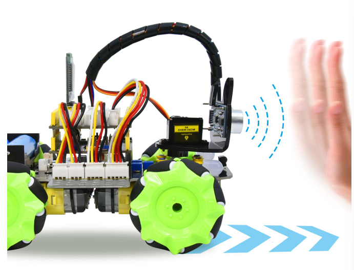
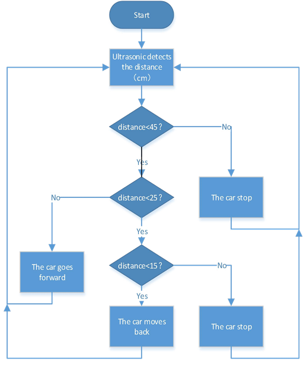

### Project 8 Ultrasonic Following Smart Car



 **1.Description**

In this project, we will work to combine an ultrasonic sensor with motors to make an automatic follow smart car.

The ultrasonic sensor detects the smart car and the obstacle distance to control the motion status of car.

 **2.Flow Diagram**



**3.Test Code**

```
#include "MecanumCar_v2.h"
#include "Servo.h"

mecanumCar mecanumCar(3, 2);  //sda-->D3,scl-->D2
Servo myservo;    //Define an instance of a servo

/*******Ultrasonic sensor interface*****/
#define EchoPin  13  //ECHO to D13
#define TrigPin  12  //TRIG to D12

void setup() 
{
  Serial.begin(9600); //Start the serial monitor and set the baud rate to 9600
  pinMode(EchoPin, INPUT);    //The ECHO pin is set to input mode
  pinMode(TrigPin, OUTPUT);   //The TRIG pin is set to output mode
  myservo.attach(9);  // attaches the servo on D9 to the servo object
  myservo.write(90); //Rotate to 90 degrees
  delay(300);//Delay in 0.3s
  mecanumCar.Init(); //Initialize the seven-color LED and the motor drive
}

void loop() 
{
  int distance = get_distance();  //Get the distance and save in the distance variable  
  Serial.println(distance);
  if (distance <= 15)  //Receding range
  {
    mecanumCar.Back();
  }
  else if (distance <= 25)  //Stop range
  {
    mecanumCar.Stop();
  }
  else if (distance <= 45) //Range of advance
  {
    mecanumCar.Advance();
  }
  else  //Other conditions stop
  {
    mecanumCar.Stop();
  }
}

int get_distance(void)  //Ultrasonic detects the distance
{   
  int dis;
  digitalWrite(TrigPin, LOW);
  delayMicroseconds(2);
  digitalWrite(TrigPin, HIGH); //Give the TRIG a high level of at least 10 µ s to trigger
  delayMicroseconds(10);
  digitalWrite(TrigPin, LOW);
  dis = pulseIn(EchoPin, HIGH) / 58.2; //Work out the distance
  delay(30);
  return dis;
}
```

**4.Test Result**

After uploading the code successfully, turn the DIP switch to ON end and power on, then the car will follow in a straight line. We put the palm of our hand in front of the ultrasonic, slowly forward, the car will follow our palm to move.

**5.Code Explanation**

```
myservo.write(90); //Make the servo rotate to 90 degrees.
```

```
int distance =get_distance();//Define an integer variable to storethe measured distance,and then control the car driving according to it.
```

```
if(distance<=15)
{
	mecanumCar.Back();
}
//When the front distance measured is less than 15cm,the car moves back.
```

```
else if(distance<=25)
{
 	mecanumCar.Stop();
}
//Otherwise,the car will stop when the front distance is less than 25 cm.
```

```
else if (distance <= 45)
{
	mecanumCar.Advance();
}
// The car will go forward when the front distance is less than 45cm.
```

```
else
{
	mecanumCar.Stop();
}
//The car will stop when the front distance is bigger than 45cm.
```

