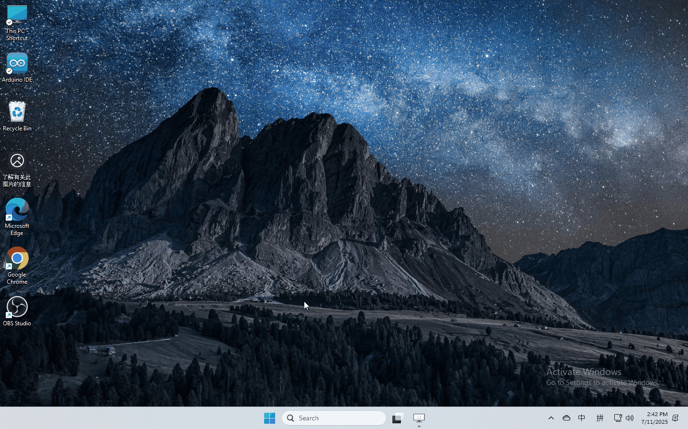
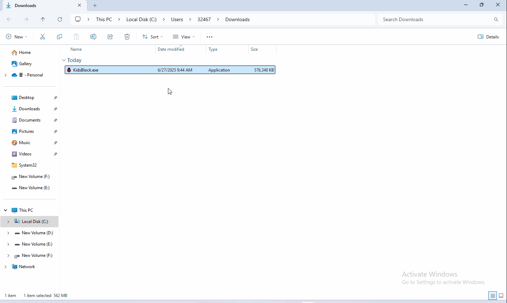
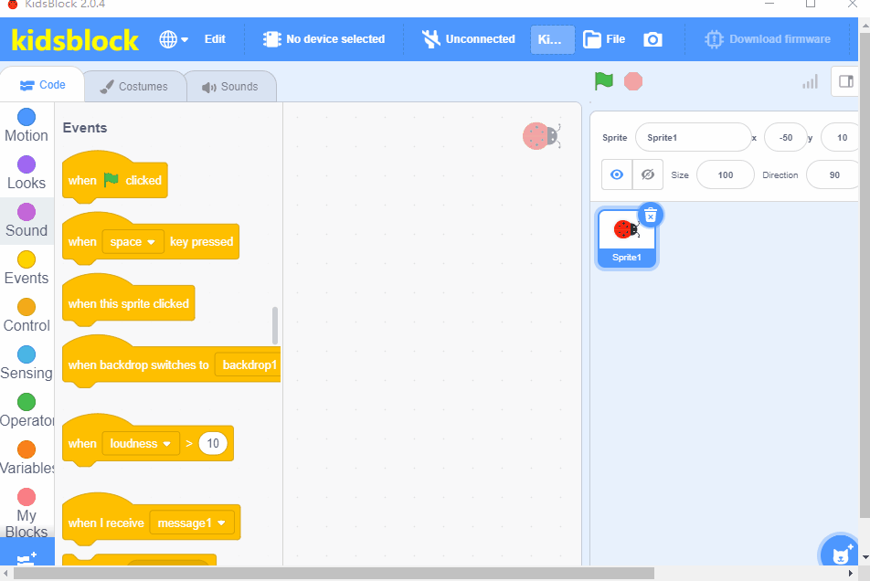
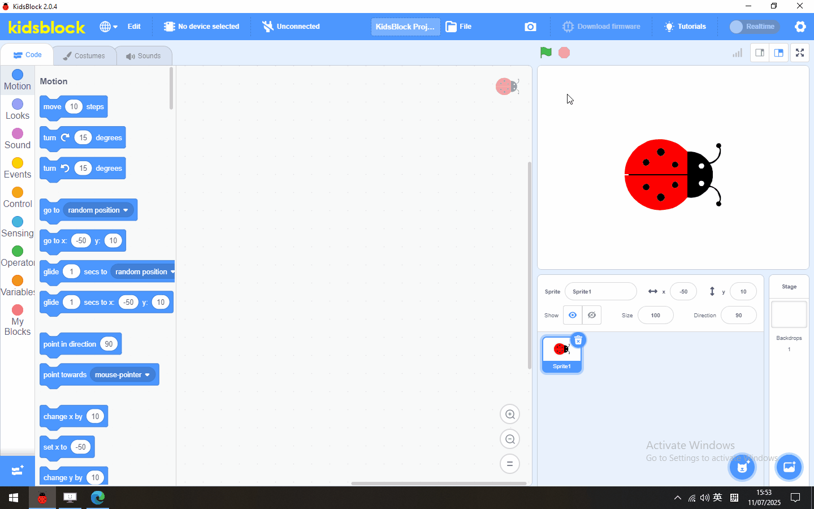

# 4. Kidsblock Tutorial

## 4.1 Data download

Scratch information contains project ,please click to download for follow-up study.

Data download： [Data download](./Kidsblock.7z)

APP download: 

**Android:**   https://xiazai.keyesrobot.cn/APP/Mecanum%20Robot.apk

**Google:**   https://play.google.com/store/apps/details?id=com.keyestudio.mecanum_robot

**Apple Store:**   https://apps.apple.com/cn/app/mecanum-robot/id1582947578

## 4.2 Software installation of Windows System

1. Download kidsblock:  https://xiazai.keyesrobot.cn/KidsBlock.exe

2. software installation

## 4.3 Software installation of Mac System

1. Download kidsblock: https://xiazai.keyesrobot.cn/KidsBlock.dmg

## 4.4 Use KidsBlock

1、operating software

First connect the development board to the computer

2、If you are unable to upload the code, please refer to the following tutorial to install the driver (optional reading)

Install driver（Windows)

Install driver（MAC)

Note: If your development board is not the driver of CH340, there will be a prompt of CH340 failure as shown in the picture, please close the interface directly and upload the code.

## 4.5 Project
