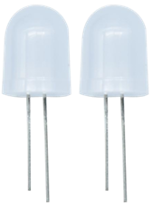
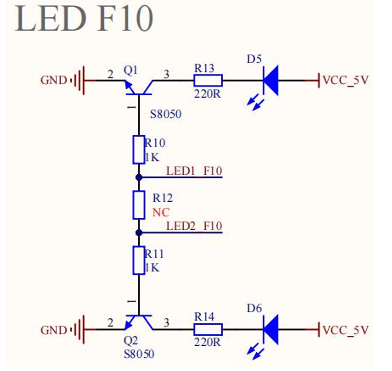
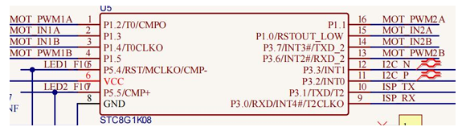
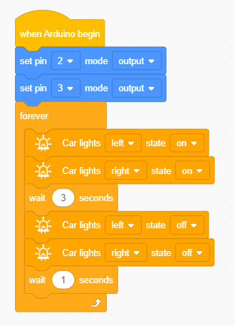

### Project 1 Seven-Color LED

**1.Description**

First we're going to finish the classic Arduino lit LED. Here we will use seven-color LEDs, which are components with a white appearance and display seven colors.

Furthermore, the module can automatically flash the built-in colors, which can be used to make charming lighting effects. It is the same as the normal LED driver, which will automatically flash seven colors when we input high level and stop flashing when at low level.

We have integrated the seven-color LEDs into our motor driver board. In the first project, we will use a basic test code to control it to blink for 3 seconds, off for 1 second to achieve the control effect. 

You can also change the time of the LEDs on and off in your code to achieve different duration effects. When in control, the LEDs will be on if S end is high level; otherwise, it will go off.

 **2.Component Knowledge**

The two seven-color LEDs are controlled by triode respectively, and the signal end is respectively connected to P5.4 and P5.5, thereby we solely need to control the two pins to output high and low levels to control the LEDs.

**3.Test Code**

**4.Test Result**

After compiling and uploading the code, turn the DIP switch to the ON end and power on, then we can see that the two seven-color LEDs on the base board will blink for 3s and then go off for1s, then repeat this all the time.