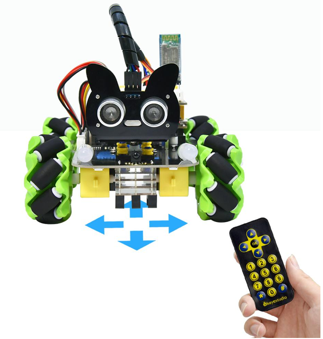
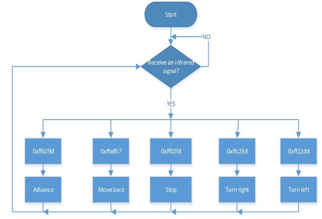
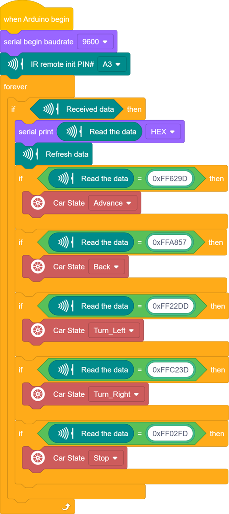

### Project 11 IR Remote Control Smart Car

**1.Description**

In this project, we will work to control the car using an IR remote control.

**2.Flow Diagram**

**3.Test Code**

**4.Test Result**

After uploading the test code and turning the DIP switch to the ON end and powering up. When we press the button on the remote control, the car moves forward, then, the car turns left,, the car moves back,, the car turns right,, the car stops.