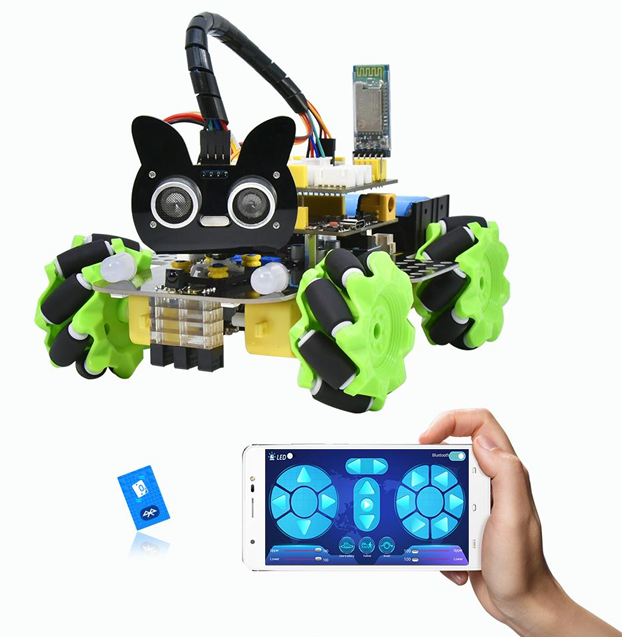
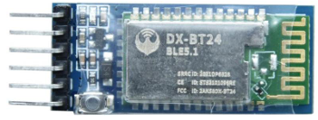
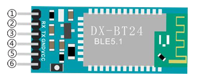
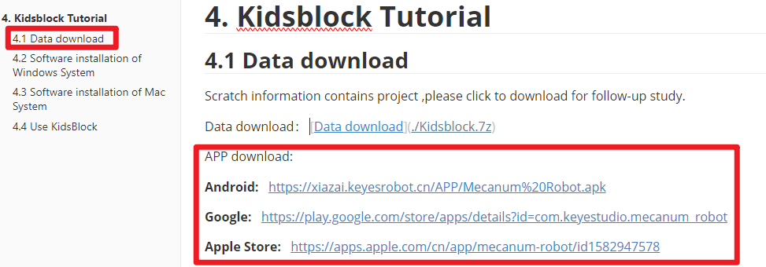
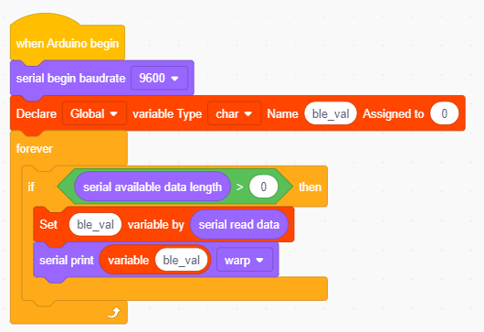
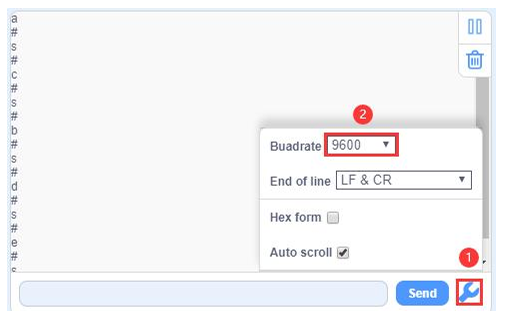
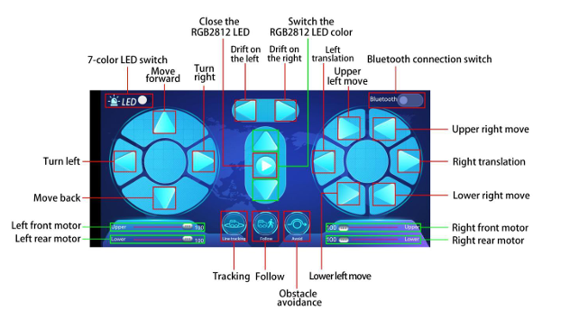

### Project 12 Bluetooth Control Smart Car

**1.Description**

There is a DX-BT24 5.1 Bluetooth module in this kit. This Bluetooth  module comes with 256Kb space and complies with V5.1 BLE Bluetooth specification, which supports AT commands. Users can change parameters such as the baud rate and device name of the serial port as required.

Furthermore, it supports UART interface and Bluetooth serial port transparent transmission, which also contains the advantages of low cost, small size, low power consumption and high sensitivity for sending and receiving. Notably, it solely needs a few peripheral components to realize its powerful functions.

In this project, we will use the BT24 Bluetooth module to combine all modules of the car in one code, which contains all functions except IR remote control mentioned in the previous projects. We plan to use mobile APP to connect Bluetooth module, so as to control various functions, which is distinctly simple and convenient.

We will work to read the control characters sent by each button through the Bluetooth connection of the APP.

**2.Parameters**

- Bluetooth protocol： Bluetooth Specification V5.1 BLE 
- Working frequency：2.4GHz ISM band 
- Communication interface： UART 
- Power supply：5V/3.3V 
- Communication distance: 40m 
- Dimension：27(L)mm x 13 (W)mm x 2(H) mm
- Bluetooth name：BT24  
- Serial port parameters：9600、eight data bits, one stop bit, no check, no flow control 
- Working temperature： MIN:-40℃- MAX:+85

The DX-BT24 module also supports the BT5.1 BLE protocol, which can be directly connected to iOS devices with BLE Bluetooth function, and supports resident running of background programs. It is mainly used in the field of short-distance data wireless transmission. It enables to avoid cumbersome cable connections and can directly replace serial cables. Successful application areas of BT24 modules:

※ Bluetooth wireless data transmission;  

※ Mobile phone, computer peripheral equipment; 

※ Handheld POS equipment; 

※ Wireless data transmission of medical equipment; 

※ Smart home control;

 ※ Bluetooth printer;

 ※ Bluetooth remote control toys; 

※ Shared bicycles;

Ports 

①STATE： Status pin 

②RX： Receiving pin 

③TX： sending pin

④GND：GND 

⑤VCC： Power 

⑥EN： Enable pin

Connect the BT module to the development board.

| Uno  | BT24 |
| ---- | ---- |
| TX   | RX   |
| RX   | TX   |
| VCC  | 5V   |
| GND  | GND  |

**3.APP**

Please download the app here.

**4.Test Code**

**5.Test Result**

After uploading the code, plug in the Bluetooth, be careful not to plug it upside down. Connect the Bluetooth module and turn on the serial monitor.

Aimat the Bluetooth module and press the APP button of the mobile phone. Wecan see the corresponding control characters of the APP button, as shown below.

Note: The RXD, TXD, GND and VCC of the Bluetooth module are connected to TX, RX, G and 5V on themotor driver expansion board respectively, while the STATE and BRK pins of the Bluetooth module do not need to be connected. The Bluetooth is plugged directly into the motor driver expansion board, we need to mind the direction, and do not plug in the Bluetooth module until you have uploaded the code.

**6.Comprehensive Project APP Control Smart Car**

Complete Test Code

After uploading the code successfully, turn the DIP switch to the ON end and powerup, plug in the bluetooth, then connect it to BT24. We can do the following operations:

Clickto open the 7-color LED, click it again the LED will be turned off.

Click to enter tracking mode, click it again will exit the mode.

 Click to enter follow mode, click it again will exit the mode.

 Clickto enter obstacle avoidance mode, click it again will exit the  mode.

Pulling these two strips will change the speed of the two motors on the left and the same operation on the right.

These buttons are used to switch the color of the four 2812 LEDs under the base board, and the middle button is used to close the function. The rest of the buttons are all used to drive the car, but unlike the other buttons, they drive when we press them and stop when we release them.

