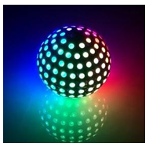
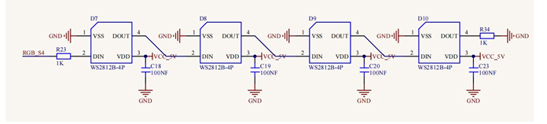
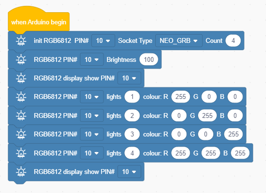
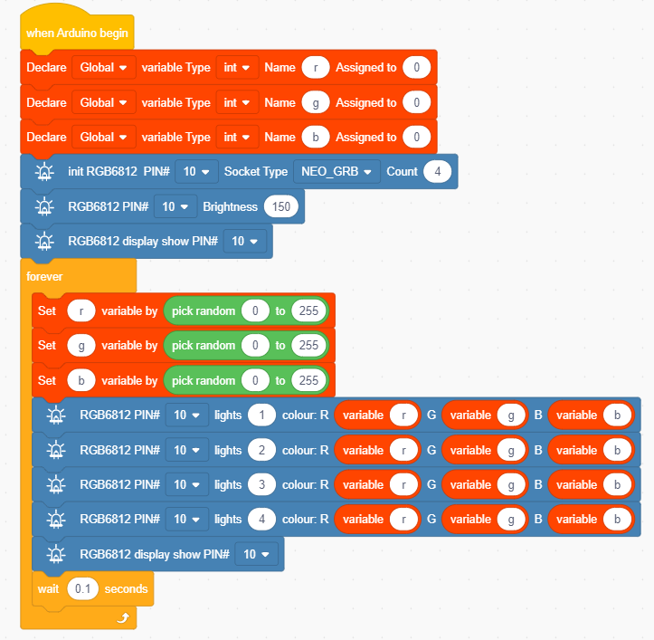

### Project 2 WS2812 RGB

**1.Description**

In this project, we will work to use WS2812 LED to display different colors. Its principle is different from the seven-color LED, we need a pin to control it. This is an intelligent external controlled LED light source integrating control circuit and light emitting circuit. The appearance of each LED is the same as that of a 5050 LED and each component is a pixel. There are four LEDs on our motor driver board, namely four pixels. Let's learn how to control it to display any color.

**2.Component Knowledge**

The four pixel LEDs are connected in series, and we can control any one of the LEDs with a pin(here we use D10) and make it display any color. The pixel contains an intelligent digital interface data locking signal and amplifying driver circuit as well as a high-precision internal oscillator and a 12V high voltage programmable constant current control part, which effectively ensures the color consistency of the pixel light.

The data protocol adopts the communication mode of single-line return to zero code. After the pixel is powered on and reset, the S terminal receives the data transmitted from the controller.

When the first 24bit data extracted by the first pixel, which will be sent to the data latch inside the pixel. This 2812RGB communication protocol and driver has been encapsulated in the bottom layer, we can directly call the interface function to use.

**3.Test Code**

**4.Test Result**

After uploading the code and turn the DIP switch to the ON end and power on, we can see that the 4 2812 LEDs will respectively be red, green, blue and white.

**5.Expanded Project Flowing Water Light**

Once the code has been uploaded successfully, we will see four LEDs showing the flowing light in a random color.