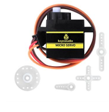
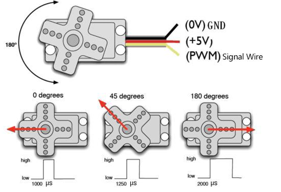
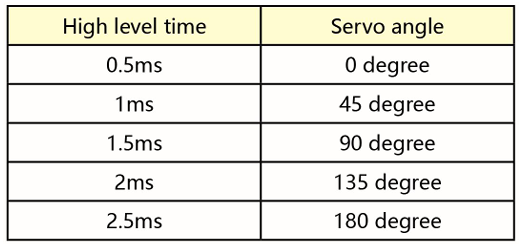

### Project 3 Servo

**1.Description**

For those DIY smart cars, they often have the function of automatic obstacle avoidance. In the DIY process, we need a servo to control the ultrasonic module to rotate left and right, and then detect the distance between the car and the obstacle, so as to control the car to avoid the obstacle.

If other microcontrollers are used to control the rotation of the servo, we need to set a certain frequency and a certain width of pulse to control the servo angle. But if arduino is used to control the servo angle, we only need to set the control angle in the development environment configuration where the corresponding pulse will be automatically set to control the servo rotation. In this project, you will learn how to control the servo to rotate back and forth between 0° and 180°.

**2.Component Knowledge**

- Angle range：0°~180°（There are 0°~360°servo，0°~180°servo，0°~90° servo） 
- Drive voltage：3.3V or 5V
- GND： This is a grounded pin, which is brown. 
- VCC: This is a pin connected to +5v（3.3V）power, which is red. 
- S：This is a pin controlled by PWM signal, which is orange.(Here we connect it to D9)

The pins are usually three wires

**3.Control Principle**

The rotation angle of servo is controlled by regulating the duty cycle of PWM (Pulse-Width Modulation) signal. The standard cycle of PWM signal is 20ms (50Hz). Theoretically, the width is distributed between 1ms-2ms, but in fact, it's between 0.5ms-2.5ms. The width corresponds to the rotation angle from 0° to 180°. But note that for different brand servo, the same signal may have different rotation angle.

The corresponding servo angle is shown in the figure below:

**4.Test Code**

**4.Test Result**

After compiling and uploading the code, then turn the DIP switch to the ON end and power on, we will see that the servo will turn back and forth from 0 degrees to 180 degrees .