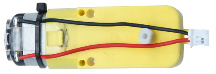
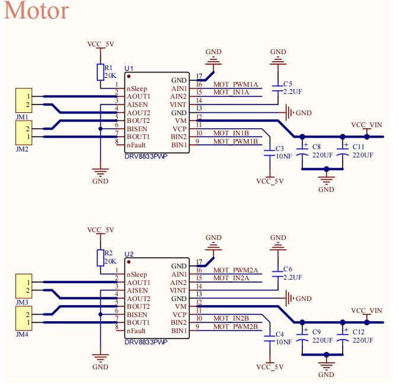
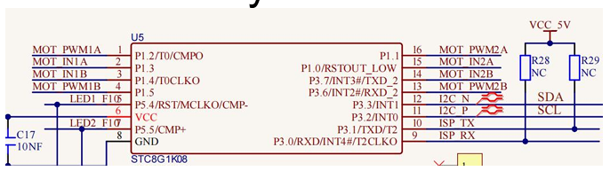
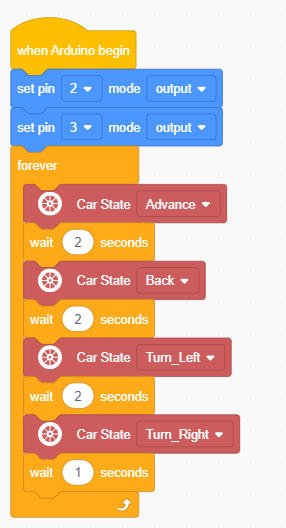

### Project 4 Reduction Motor

**1.Description**

The kit is equipped with 4 DC reduction motors, which are developed on the ordinary DC motors. It has a matching gear reduction box which provides a lower speed but a larger torque. Furthermore, different reduction ratios of the box can provide different speeds and torques.

The reduction motor is the integration of gearmotor and motor, which is applied widely in steel and machine industry.

The current of the motor driver is relatively large. If we use the IO port to force the motor to drive, either the motor will not rotate or the IO port will be burned, thereby it entails a motor driver chip. The DRV8833 motor driver chip has been included on the motor driver base board, which is used to control the rotation direction and speed of the 4 DC reduction motors. The circuit schematic diagram of the two chips are as below.

**2.Component Knowledge**

Each chip controls 4 pins, and 2 pins control one motor.

**3.Test Code**

**4.Test Result**

After compiling and uploading the code, turn the DIP switch to the ON end and power on, and we can see that the car goes forward for 2s,goes back for 2s, turns left for 2s, turns right for 2s and then stops for 1s.