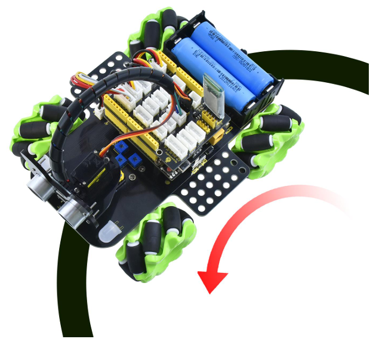
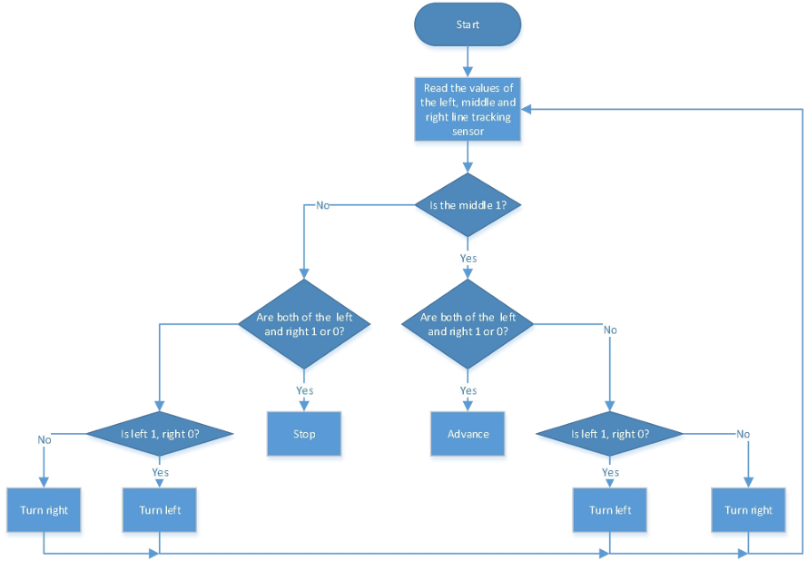
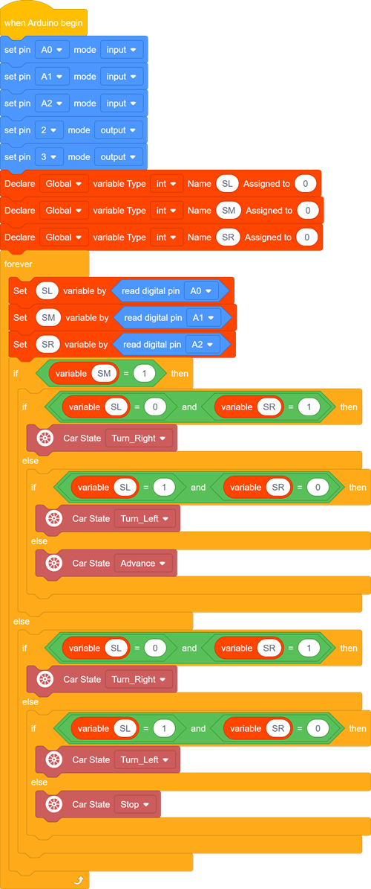

### Project 6 Line Tracking Smart Car

**1.Description**

In this project we will make a line tracking smart car. It works to use a line tracking sensor to detect the black track of the road, and the road surface detection signal is fed back to the control board. The control board analyzes and judges the collected signals, and timely controls the motor to adjust the direction of the car, making the car run automatically along the black track  to realize the purpose of automatic tracking of the car.

**2.Flow Diagram**

**3.Test Code**

**4.Test Result**

After uploading the test code successfully, turn the DIP switch to ON end and power up and the smart car will drive along the black line.