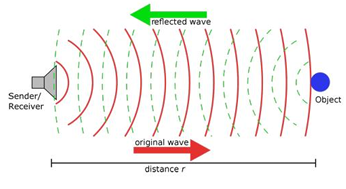
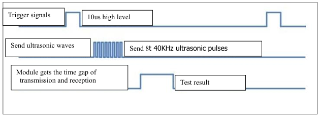
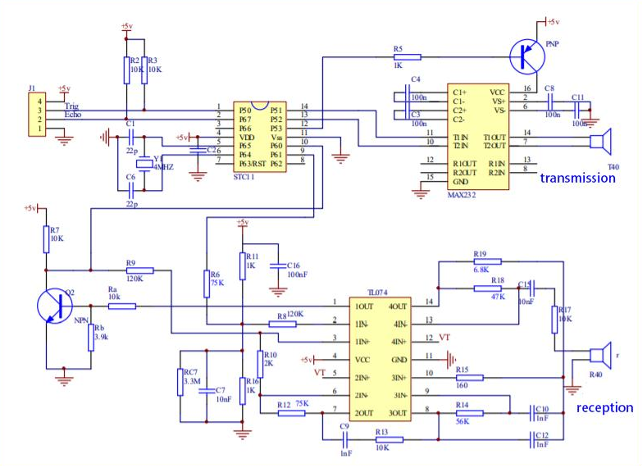
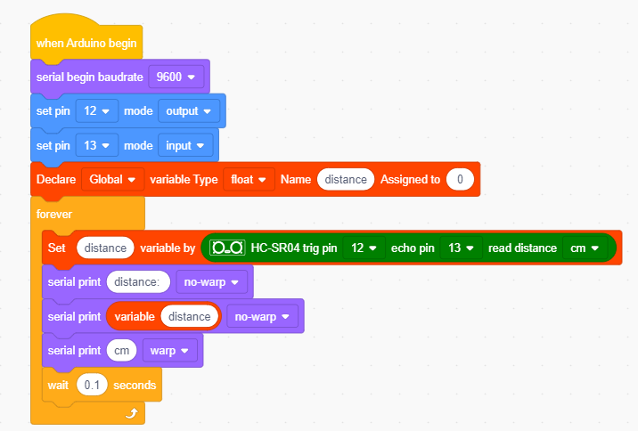
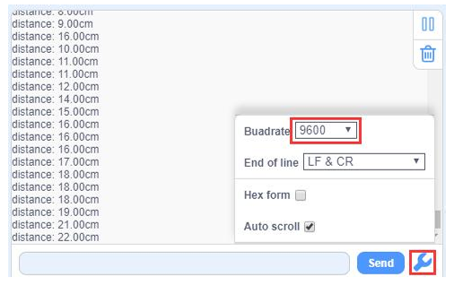

### Project 7 Ultrasonic Sensor

**1.Description**

The ultrasonic sensor uses sonar to determine distance to an object like bats do. It offers excellent non-contact range detection with high accuracy and stable readings in an easy-to-use package. It comes complete with an ultrasonic transmitter and a receiver module.

The ultrasonic sensor is being used in a wide range of electronic projects for creating obstacle detection and distance measuring application as well as various other applications.

In this project, we will work to show simple ways for distance with UNO PLUS development board and the ultrasonic sensor, and learn how to use the sensor in arduino IDE.

**2.Parameters and Principle**

- Working voltage:+5V DC 
- Quiescent current: <2mA 
- Working current: 15mA 
- Sensing angle: <15° 
- Distance range: 2cm– 400 cm 
- Precision: 0.3 cm 
- Measuring angle: 30 degree
- Input trigger pulse: 10us

**Principle**

The ultrasonic transmitter emits ultrasonic waves in a certain direction, and the counter starts timing at the same time of the launch. The ultrasonic wave spreads in the air and is immediately reflected back when encountering obstacles on the way.

When it stops timing immediately, the ultrasonic wave is also a sound wave whose speed V is related to temperature. Generally, the transmission speed of the wave in the air is 340m/s. According to the time t recorded by the timer, the distance s from the launching point to the obstacle surface can be calculated, that is, S =340t/2:

(1) Pull down TRIG then trigger high level signals with least 10us; 

(2) After triggering, the module will automatically send eight 40KHz ultrasonic pulses and detect whether there is a signal return; 

(3) If there is a signal return, ECHO outputs a high level, the high level read by the microcontroller time duration is the time of the ultrasonic wave from transmitting to returning.

Circuit diagram of ultrasonic sensor:

**3.Test Code**

**4.Test Result**

After uploading the test code successfully, open the serial monitor and clickto set the baud rate to 9600, which will display the distance detected by the ultrasonic sensor. Move the obstacle in front of the car and we can see the distance will change too, as shown in the following figure.

