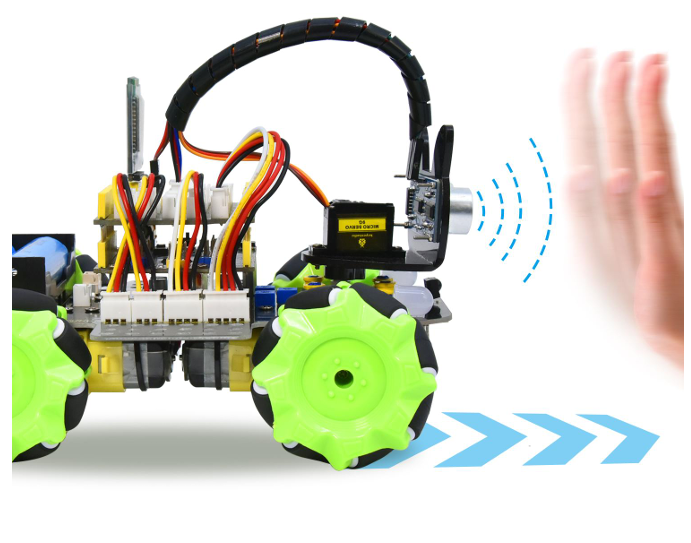
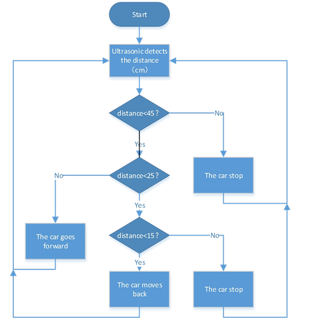
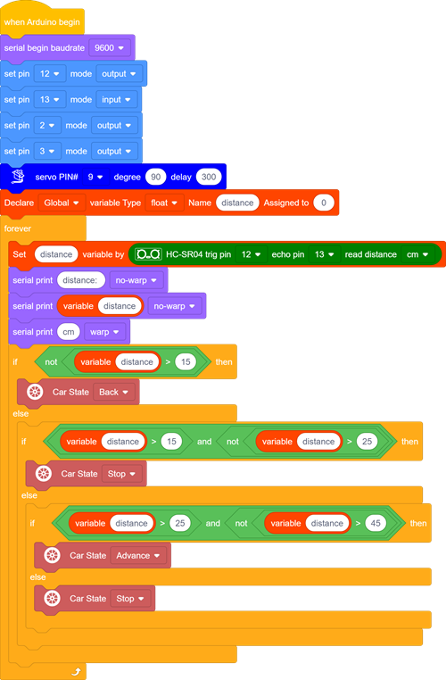

### Project 8 Ultrasonic Following Smart Car

**1.Description**

In this project, we will work to combine an ultrasonic sensor with motors to make an automatic follow smart car.

The ultrasonic sensor detects the smart car and the obstacle distance to control the motion status of car.

**2.Flow Diagram**

 **3.Test Code**

**4.Test Result**

After uploading the code successfully, turn the DIP switch to ON end and power on, then the car will follow in a straight line. We put the palm of our hand in front of the ultrasonic, slowly forward, the car will follow our palm to move.