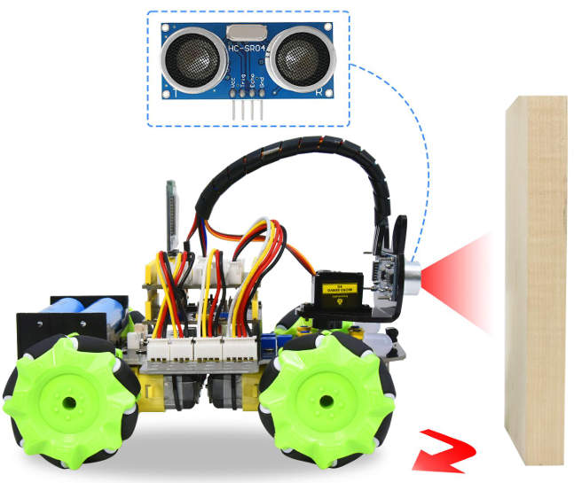
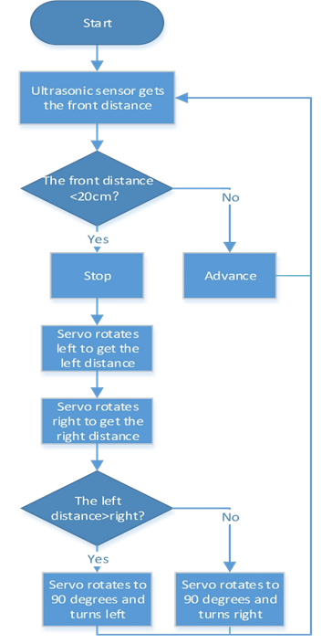
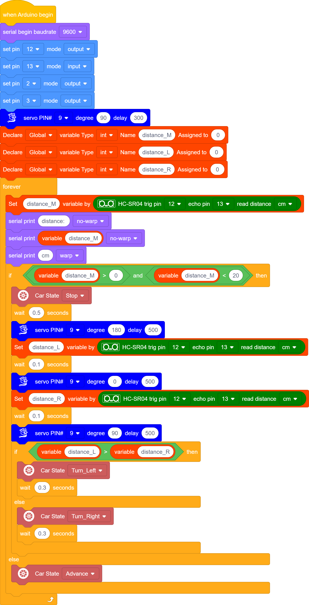

### Project 9 Ultrasonic Obstacle Avoidance Smart Car

**1.Description**

Ultrasonic obstacle avoidance smart car is used to control the car motion state, so as to achieve obstacle avoidance by using the ultrasonic sensor detecting the obstacles distance.

**2.Flow Diagram**

**3.Test Code**

**4.Test Result**

After uploading the code successfully, turn the DIP switch to the ON end and power up, then the car can automatically avoid obstacles. Note that the speed can’t be too large.

The car will stop when encountering obstacles in front of it and the servo cradle head will rotate left to detect the left distance, then rotate right to detect the right distance. Then judge the distance between the obstacles on the left and the right, the car will turn along the farther side, and then continue to drive.